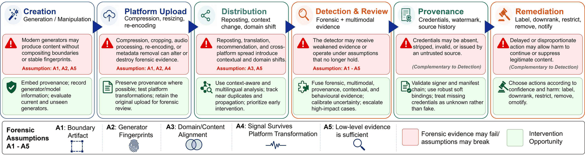
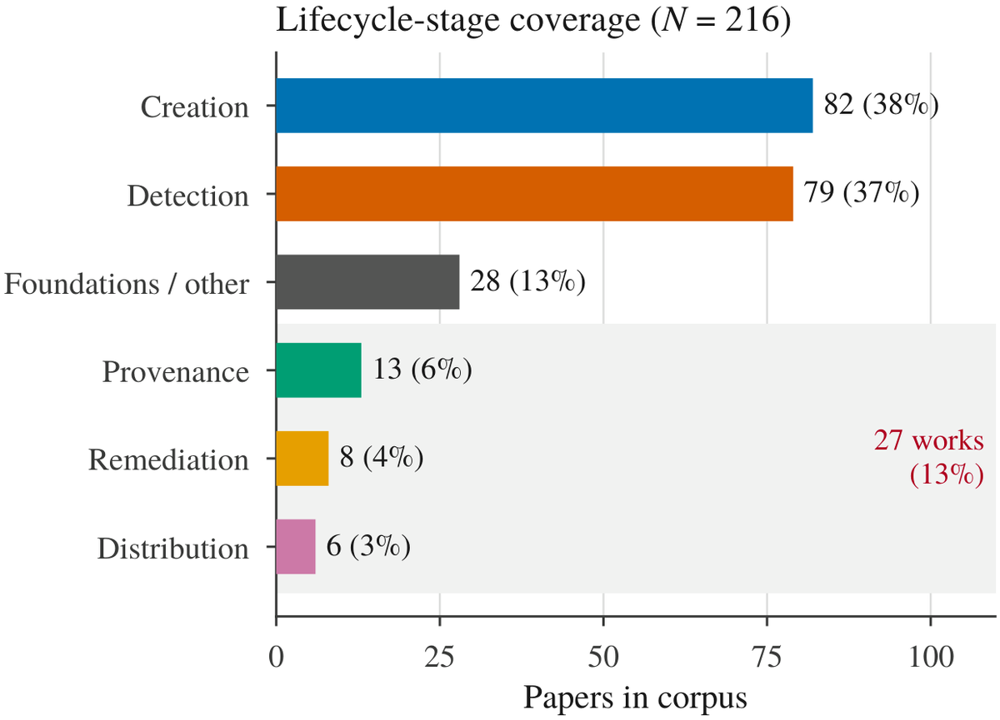
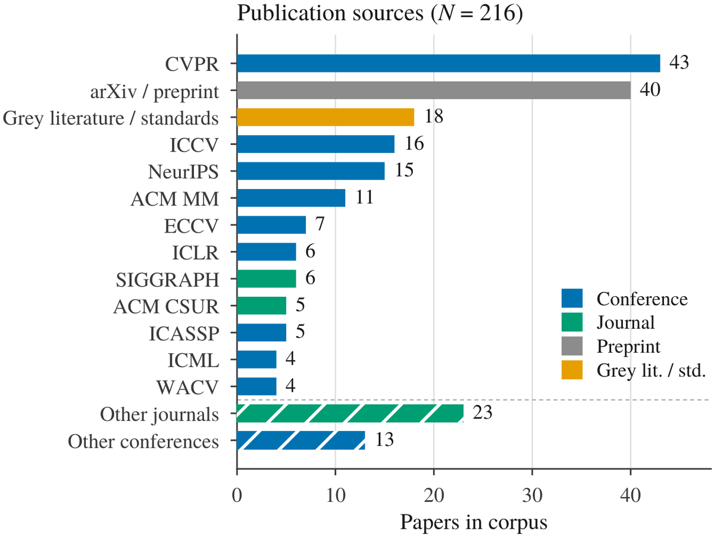
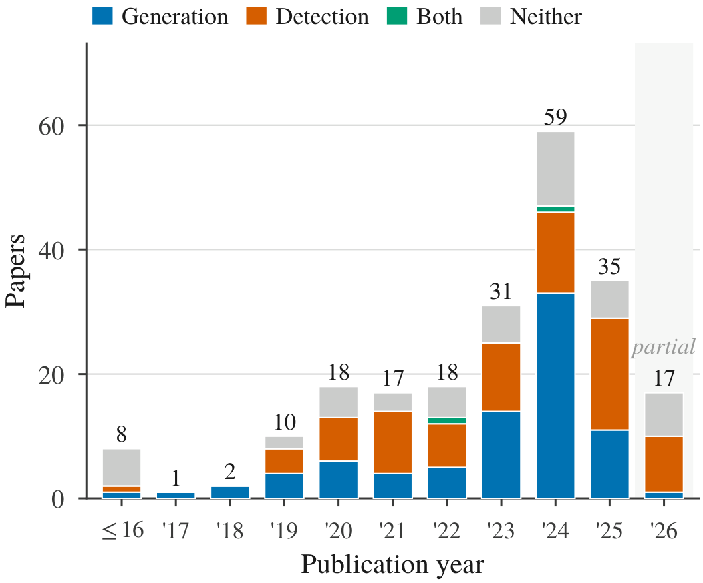
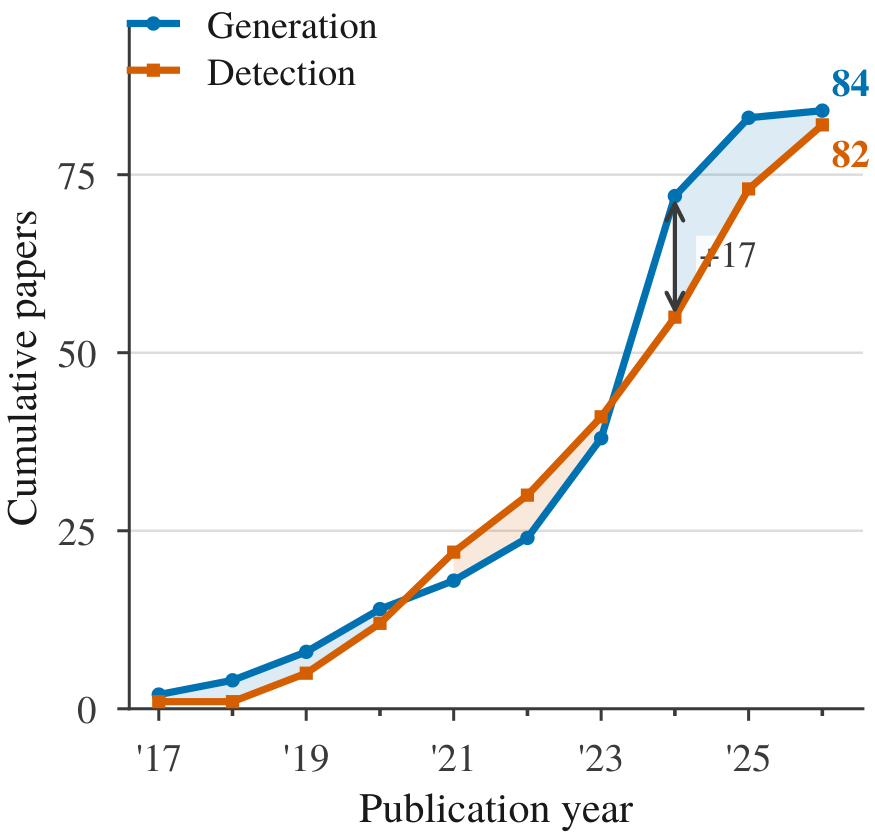
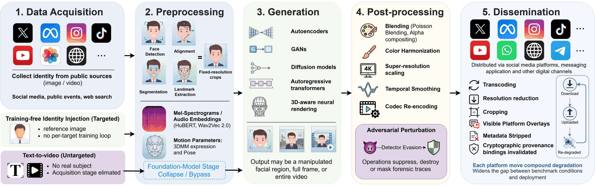

# Deepfakes in the Foundation-Model Era: A Survey of Forensics, Distribution, and Provenance

[](https://github.com/VectorInstitute/deepfakes-survey-2026)
[](https://vectorinstitute.github.io/deepfakes-survey-2026/)
[](#-the-evidence-gap)
[](#-papers-by-category)
[](LICENSE)
[](CONTRIBUTING.md)

---

<div align="center">
  
  <p><em><strong>Figure 5.</strong> The deepfake lifecycle, its forensic failure points, and the intervention opportunities at each stage. Generation, platform processing, and distribution may alter or remove forensic evidence before detection, while provenance, contextual evidence, and human review provide complementary signals for downstream remediation.</em></p>
</div>

## 🌟 Overview


Companion repository for our survey on **real-world deepfake detection**. Deepfake detection is usually measured on curated benchmarks, yet most synthetic video reaches an audience through social media platforms that compress, resize, re-encode, crop, and repost it long before any detector sees it.

The practical question is therefore not whether a detector separates real from fake under laboratory conditions, but **whether the evidence it depends on still exists at the moment a decision has to be made**.

**Authors:** Shaina Raza¹, Jessee Ho¹, Ahmed Y. Radwan¹, Mohamed Hafez¹

¹Vector Institute for Artificial Intelligence

| | |
|---|---|
| **Corpus** | 212 works; 73% peer-reviewed; median publication year 2024 |
| **References** | 212 cited works, all listed below |
| **Search window** | January 2017 – August 2026 |
| **Databases** | IEEE Xplore · ACM DL · SpringerLink · ScienceDirect · OpenReview · PMLR · AAAI DL · arXiv |
| **Scope** | Audio-video deepfakes, from generation through platform distribution to remediation |

---

## What the survey covers


A deepfake is not simply a video to classify. It passes through a lifecycle of creation, upload, platform processing, recommendation, viewing, reporting, review, and eventual removal, labelling, or continued spread. Media transformations within that lifecycle — compression, re-encoding, cropping, reposting — weaken or alter the very forensic traces that detectors rely on.

The survey treats the whole chain as one problem:

- **Generation** (§3) — an evidence-based taxonomy linking manipulation types to the forensic traces they leave
- **Detection** (§4) — signal-driven, learning-based, reasoning-based, agentic, and adversarially robust methods
- **Distribution** (§5.1–5.2) — platform processing and algorithmic propagation as transformations *on evidence*
- **Provenance** (§5.3) — content credentials and watermarking, and where each one fails
- **Remediation** (§5.4) — disclosure and takedown regulation, and what it inherits from upstream failures

---

## 🔑 The Five Forensic Assumptions


Detectors rely on assumptions about the evidence available to them. The survey groups these expectations into five assumptions, **A1–A5**, which form its analytical spine. Every section states which assumptions the methods it reviews depend on — and which ones fail.

| | Assumption | What it buys a detector | When it fails |
|:---:|---|---|---|
| **A1** | A manipulated region leaves a **boundary** | Compositing seams; texture, resolution, colour and compression differences at the edit border | Fully synthetic video — every pixel is generated, so there is nothing to composite against |
| **A2** | A generator leaves a **stable fingerprint** | Upsampling and frequency-domain traces that support detection or attribution | Patterns change across models, versions, fine-tuning methods, and post-processing |
| **A3** | Test videos **resemble the training data** | Discriminative power on the manipulation types seen during training | Deployment brings new generators, manipulation methods, identities, scenes, or recording conditions |
| **A4** | Forensic signals **survive processing** | Low-level evidence that is still measurable at decision time | Social-media video is resized, filtered, compressed, or re-encoded several times |
| **A5** | **Low-level clues are enough** | Pixels, textures, frequencies, frame-level motion, cross-modal mismatch | Realistic generation demands semantic and multimodal reasoning that low-level detectors miss |

> **Reading the A1–A5 labels.** They mean different things in different tables. In the **generation** table they report whether an assumption *holds* for a method's outputs. In the **detection** table they indicate whether a method *depends on* an assumption or *mitigates* its failure. In the **dataset** table they identify the assumptions a benchmark can *stress-test*. Fewer filled circles in the generation table therefore indicates a harder detection problem, not a more capable generator.

**How the assumptions relate across the taxonomy.** `A1` weakens as manipulation expands from localized edits to full-frame generation. `A2` remains relevant but is challenged by chained generators that obscure fingerprints. `A5` is weakened when audio and video are generated jointly, since cross-modal and semantic inconsistencies may be reduced. `A3` and `A4` are not properties of the manipulation at all — they are set by what a detector was trained on and by what the media has been through since, which is why the lifecycle in §5 is part of the same problem.

---

## 📊 The evidence gap

<details>
<summary>Corpus breakdown, coverage table, and key trends</summary>

<div align="center">
  
  
  <br/>
  
  
  <p><em><strong>Figure 3.</strong> Overview of the reviewed corpus. (a) Creation and detection account for 75% of the corpus, compared with 13% for distribution, provenance, and remediation combined. (b) Publication sources by venue type; 73% of the corpus is peer-reviewed. (c) Publications per year by primary generation/detection role; the 2026 bar is partial (January–August). (d) Cumulative generation and detection coverage over time.</em></p>
</div>

**Key trends:**

- **Coverage imbalance** — Creation and detection account for **75%** of the corpus, while distribution, provenance, and remediation together account for **13%**. The stages that determine what evidence survives to a detector are among the least studied.
- **Benchmarks do not transfer** — Deepfake-Eval-2024 collects roughly 44 hours of video from 88 web sources and reports an average **50% AUC reduction** for evaluated open-source video detectors relative to their original benchmarks.
- **Prevalence dominates deployment** — At 0.1% synthetic-media prevalence, a detector with TPR = 0.90 and FPR = 0.01 reaches only about **8.3% precision**. Threshold-independent AUC hides this entirely.

</details>


---

## 🔎 Literature screening

<details>
<summary>PRISMA diagram and screening counts</summary>

<div align="center">
  
  <p><em><strong>Figure 2.</strong> Literature screening and selection process.</em></p>
</div>

| Phase | Records | Excluded |
|---|---:|---|
| Identified through database search and supplementary sources | 1,247 | 203 duplicates removed |
| Screened by title & abstract | 1,044 | 614 excluded as irrelevant |
| Full-text articles assessed for eligibility | 430 | 218 excluded after full-text review |
| **Works included in survey** | **212** | — |

</details>


---

## 🗺️ Survey structure

<details>
<summary>Full section-by-section outline</summary>

<table>
<tr><th align="left" width="26%">Section</th><th align="left">Contents</th></tr>
<tr><td><strong>§2 Background &amp; Forensic Foundations</strong></td><td>
<strong>2.1 Deepfake video pipeline</strong> — acquisition → preprocessing → generation → post-processing → dissemination; every stage adds, alters, or suppresses forensic traces<br/>
<strong>2.2 Generative modelling foundations</strong> — AE/VAE; GAN; diffusion; autoregressive; 3D-aware<br/>
<strong>2.3 Forensic signals &amp; assumptions A1–A5</strong> — boundary artifacts, stable fingerprints, distribution alignment, signal fidelity, semantic independence
</td></tr>
<tr><td><strong>§3 Taxonomy of Generative Deepfakes</strong></td><td>
<strong>3.1 Identity-centric</strong> — <em>A1 holds → fails</em><br/>
<strong>3.2 Body-centric</strong> — <em>A1 scales with extent</em><br/>
<strong>3.3 Audio-centric</strong> — <em>A2 load-bearing, A5 breaks</em><br/>
<strong>3.4 Scene-centric</strong> — <em>A1 and A3 fail</em><br/>
<strong>3.5 Hybrid &amp; multimodal</strong> — <em>A5 and A2 fail</em><br/>
<strong>3.6 Cross-cutting temporal &amp; partial</strong> — the manipulated interval is the unit
</td></tr>
<tr><td><strong>§4 Detection, Localization &amp; Attribution</strong></td><td>
<strong>4.1 Problem formulation</strong> — binary, fine-grained, localization, attribution, calibration<br/>
<strong>4.2 Signal-driven forensics</strong> — <em>A1, A2, A4, A5</em><br/>
<strong>4.3 Learning-based architectures</strong> — <em>A3 dominant</em><br/>
<strong>4.4 Generalization &amp; adaptation</strong> — <em>A3 cannot be removed</em><br/>
<strong>4.5 Reasoning-based &amp; agentic detection</strong> — <em>substitutes for A5</em><br/>
<strong>4.6 Adversarial robustness &amp; evasion</strong> — <em>A2 and A3 are attackable</em>
</td></tr>
<tr><td><strong>§5 Social Media Lifecycle</strong></td><td>
<strong>5.1 Platform upload &amp; forensic transformation</strong> — <em>A1, A2, A4</em><br/>
<strong>5.2 Algorithmic propagation &amp; cross-platform reposting</strong> — <em>A3, A5</em><br/>
<strong>5.3 Provenance &amp; content authenticity</strong> — <em>A4, and A2 for keyed recovery</em><br/>
<strong>5.4 Platform governance &amp; remediation</strong> — <em>inherits upstream failures</em><br/>
<strong>5.5 Failure points &amp; interventions</strong>
</td></tr>
<tr><td><strong>§6 Datasets &amp; Evaluation</strong></td><td>
<strong>6.1 Benchmark evolution</strong> · <strong>6.2 Evaluation tasks &amp; metrics</strong> · <strong>6.3 Recommended protocol &amp; assumption reporting</strong>
</td></tr>
<tr><td><strong>§7 Findings</strong></td><td>Assumption-level synthesis, <strong>F1–F6</strong></td></tr>
<tr><td><strong>§8 Discussion</strong></td><td><strong>8.1 Impact of this study</strong> · <strong>8.2 Open questions Q1–Q5</strong> · <strong>8.3 Limitations</strong></td></tr>
<tr><td><strong>§9 Conclusion</strong></td><td>Post-artifact synthesis</td></tr>
</table>

</details>


---

## 🏗️ The deepfake attack pipeline

<details>
<summary>Figure 4 and the collapse in data cost</summary>

<div align="center">
  
  <p><em><strong>Figure 4.</strong> The deepfake video pipeline spanning data acquisition, preprocessing, generation, post-processing, and dissemination. Traditional identity-specific and audio-driven workflows are contrasted with foundation-model generation, while the annotations indicate how forensic traces are introduced, modified, suppressed, or degraded across stages.</em></p>
</div>

The data cost of a convincing target has collapsed. Traditional face-swap systems required hundreds or thousands of identity-specific frames and per-target training. Training-free identity-conditioning methods now operate from **a single reference image**, and text-to-video foundation models generate realistic synthetic individuals with **no target-specific data at all**.

</details>


---

## 🧬 Generative paradigms and the evidence they leave

<details>
<summary>Table 2 with the A1–A5 status of each paradigm</summary>

Table 2 of the survey.  the assumption generally holds ·  partially holds ·  generally does not. **Evid.** is the usable forensic evidence remaining for a detector, from High (multiple independent traces) to Low (few or none).

| Generative paradigm | Scope | A1 | A2 | A3 | A4 | A5 | Evid. |
|---|---|:-:|:-:|:-:|:-:|:-:|:-:|
| Autoencoder/VAE-based face swapping | Localized face | ● | ● | ● | ◐ | ● | **High** |
| GAN-based face swapping | Localized face | ● | ● | ◐ | ◐ | ● | **High** |
| GAN-based reenactment and video synthesis | Localized or full frame | ◐ | ● | ◐ | ◐ | ◐ | Mod. |
| Diffusion-based editing and inpainting | Localized to broad region | ◐ | ◐ | ○ | ○ | ◐ | Mod. |
| NeRF-based talking-head synthesis | Head or portrait | ○ | ◐ | ○ | ◐ | ◐ | Mod. |
| 3DGS-based talking-head synthesis | Head or portrait | ○ | ◐ | ○ | ◐ | ◐ | Mod. |
| Diffusion-based video generation | Fully synthetic video | ○ | ◐ | ◐ | ◐ | ○ | *Low* |
| Hybrid diffusion talking-head synthesis | Head or portrait | ○ | ◐ | ◐ | ○ | ○ | *Low* |
| Autoregressive and hybrid video generation | Fully synthetic video | ○ | ◐ | ○ | ○ | ○ | *Low* |
| Flow-based generation | Image/full-frame synthesis | ○ | ◐ | ○ | ○ | ○ | *Low* |

</details>


---

## 🔄 What platforms do to the evidence

<details>
<summary>Table 5: nine platform transformations and their measurement status</summary>

Table 5 of the survey. *Described* denotes effects reported without a quantitative magnitude. Metadata stripping is marked **n/a** because it removes external records rather than media-internal evidence.

| Transformation | Stage | Affects | Reported effect | Evidence |
|---|---|:---:|---|:---:|
| Transcoding and re-encoding | Upload | `A2, A4` | Suppresses generation traces and introduces codec artifacts the detector must separate from them | **Measured** |
| Resolution reduction and resizing | Upload | `A1, A4` | Weakens localized blending boundaries first; smallest edited regions degrade earliest | **Measured** |
| Cropping and visible overlays | Upload, repost | `A1, A3` | Removes boundary regions and surrounding context; changes detector input framing | Described |
| Metadata stripping | Upload | `n/a` | Invalidates manifest binding; recovery falls back to durable credentials | Described |
| Audio transcoding and resampling | Upload | `A2, A4` | Alters vocoder and neural-codec residuals used by acoustic detectors | Partial |
| Repeated download and reupload | Cross-platform | `A2, A4` | Compounds the above; no reported degradation curve over repost depth | *Not measured* |
| Screen recording | Repost | `A1, A2, A4` | Full resample; removes compression history entirely | *Not measured* |
| Cross-platform, cross-language | Distribution | `A3, A5` | Moves media outside the training distribution and separates it from interpretive context | Described |
| **End-to-end in-the-wild effect** | All | `A2–A5` | Open-source video detectors lose approximately half their benchmark AUC on contemporary circulated media | **Measured** |

</details>


---

## 📌 Findings (F1–F6)

<details>
<summary>The six assumption-level findings</summary>

Applying A1–A5 uniformly across the reviewed generation methods, detectors, platform transformations, and benchmarks yields six findings.

**F1. Research emphasizes A3 more than A4.** Of the **50 detectors** coded in Table 4, **36** explicitly mitigate distribution shift (`A3`), whereas **39** depend on forensic signals surviving processing (`A4`) and only **10** mitigate its failure. Five of these ten are reasoning-based or agentic systems, whose multiple inference or tool calls may limit their suitability for platform-scale screening. Although `A4` is widely assumed by existing methods, comparatively few directly address its failure.

**F2. Boundary evidence is becoming less central.** In Table 4, **41 of 50** detectors neither depend on `A1` nor explicitly mitigate its failure. Residual boundary evidence declines from High for autoencoder- and GAN-based face manipulation to Low for diffusion, autoregressive, and flow-based full-frame generation. `A1` therefore remains most relevant to localized manipulations such as compositing, lip-sync editing, and body transfer rather than fully synthetic generation.

**F3. Generalization is often evaluated through a narrow cross-dataset shift.** **Eighteen of the 50** detectors report FaceForensics++ → Celeb-DF v2 as a principal cross-dataset evaluation. Both benchmarks primarily represent pre-foundation-model facial manipulation, so this protocol measures transfer between related face-manipulation distributions rather than open-world generalization to contemporary generators. `A3` is therefore the most frequently mitigated assumption, while its evaluation remains comparatively narrow.

**F4. Foundation-model content remains under-evaluated.** Of the 50 detectors, **34** report no evaluation on diffusion- or foundation-model-generated media, **two** provide partial evaluation, and **14** explicitly evaluate such content. This represents a gap in the evaluation record rather than evidence that earlier detectors necessarily fail. Existing methods should be re-evaluated on contemporary generation paradigms before performance gaps are attributed solely to architectural limitations.

**F5. Lifecycle effects are more often described than quantified.** Of the **nine** entries in Table 5, **three** report quantitatively measured effects and **one** has partial evidence. Repost depth and screen recording lack reported degradation curves, and no work in the reviewed corpus reports time to detection, posts observed before detection, or platforms reached. This mirrors the broader corpus imbalance: only **13%** of the reviewed works address distribution, provenance, and remediation, compared with **75%** covering creation and detection.

**F6. Benchmarks emphasize generator and distribution diversity over signal survival.** Across the **22** benchmarks in Table 6, generator diversity (`A2`) is exercised by **21** and train–test dissimilarity (`A3`) by **20**, whereas signal survival under processing (`A4`) is exercised by **12** and boundary availability (`A1`) by **13**; only **three** exercise all five assumptions. Current benchmark coverage therefore favors generator and distribution diversity, while substantially fewer benchmarks test whether forensic evidence survives realistic processing.

> **Two consequences follow.** First, provenance cannot fully compensate for this evaluation gap because its coverage depends on adoption by generators and platforms; open-weight, forked, or locally operated pipelines may remain outside participating provenance ecosystems regardless of watermark robustness. Second, the findings motivate greater emphasis not only on improving classifiers, but on measuring which forensic signals survive real distribution pipelines and reporting detector performance under those conditions.

</details>


---

## 📖 Papers by Category


All **212 references cited by the survey**, organized by the role each plays in the argument. Groups follow the paper's own tables: generation groups mirror Table 3, detection families mirror Table 4, and benchmarks mirror Table 6. Entries are ordered newest-first within a subsection, and blockquotes give the assumption note the survey attaches to that group.

> Corpus size and reference count now agree: the survey reviews 212 works and cites 212 references.

## 1. Foundations & Forensic Context

Section 2 of the survey: the five-stage attack pipeline, the generative paradigms behind it, and the A1–A5 framework.

<details>
<summary><strong>Generative modelling foundations</strong> &nbsp;<sub>17 entries</sub></summary>

> The paradigms behind deepfake video, and the traces each one leaves.

**2024**

- [2024] **Autoregressive Image Generation without Vector Quantization** *Tianhong Li et al.* [[paper](https://arxiv.org/abs/2406.11838)]
- [2024] **FLUX** *Black Forest Labs* [[paper](https://github.com/black-forest-labs/flux)]
- [2024] **Movie Gen: A Cast of Media Foundation Models** *Adam Polyak et al.* [[paper](https://arxiv.org/abs/2410.13720)]
- [2024] **Scaling rectified flow transformers for high-resolution image synthesis** *Patrick Esser et al.* [[paper](https://arxiv.org/abs/2403.03206)]
- [2024] **Veo: High-Fidelity Video Generation Model** *Google DeepMind* [[paper](https://deepmind.google/technologies/veo)]
- [2024] **VideoPoet: A Large Language Model for Zero-Shot Video Generation** *Dan Kondratyuk et al.* [[paper](https://arxiv.org/abs/2312.14125)]

**2023**

- [2023] **3d gaussian splatting for real-time radiance field rendering** *Bernhard Kerbl et al.* [[paper](https://doi.org/10.1145/3592433)]
- [2023] **Align Your Latents: High-Resolution Video Synthesis with Latent Diffusion Models** *Andreas Blattmann et al.* [[paper](https://doi.org/10.1109/cvpr52729.2023.02161)]
- [2023] **CogVideo: Large-Scale Pretraining for Text-to-Video Generation via Transformers** *Wenyi Hong et al.* [[paper](https://arxiv.org/abs/2205.15868)]

**2022**

- [2022] **High-Resolution Image Synthesis with Latent Diffusion Models** *Robin Rombach et al.* [[paper](https://arxiv.org/abs/2112.10752)]
- [2022] **StyleGAN-V: A Continuous Video Generator with the Price, Image Quality and Perks of StyleGAN2** *Ivan Skorokhodov et al.* [[paper](https://doi.org/10.1109/cvpr52688.2022.00361)]
- [2022] **Video Diffusion Models** *Jonathan Ho et al.* [[paper](https://arxiv.org/abs/2204.03458)]

**2020**

- [2020] **Denoising Diffusion Probabilistic Models** *Jonathan Ho et al.* [[paper](https://arxiv.org/abs/2006.11239)]

**2019**

- [2019] **A style-based generator architecture for generative adversarial networks** *Tero Karras et al.* [[paper](https://doi.org/10.1109/cvpr.2019.00453)]

**2018**

- [2018] **MoCoGAN: Decomposing Motion and Content for Video Generation** *Sergey Tulyakov et al.* [[paper](https://doi.org/10.1109/cvpr.2018.00165)]

**2014**

- [2014] **Auto-Encoding Variational Bayes** *Diederik P. Kingma et al.* [[paper](https://arxiv.org/abs/1312.6114)]
- [2014] **Generative Adversarial Nets** *Ian Goodfellow et al.* [[paper](https://arxiv.org/abs/1406.2661)]

</details>

<details>
<summary><strong>Preprocessing and representation</strong> &nbsp;<sub>2 entries</sub></summary>

**2020**

- [2020] **wav2vec 2.0: A framework for self-supervised learning of speech representations** *Alexei Baevski et al.* [[paper](https://arxiv.org/abs/2006.11477)]

**2016**

- [2016] **Joint face detection and alignment using multitask cascaded convolutional networks** *Kaipeng Zhang et al.* [[paper](https://doi.org/10.1109/lsp.2016.2603342)]

</details>

<details>
<summary><strong>Forensic signals</strong> &nbsp;<sub>3 entries</sub></summary>

**2019**

- [2019] **Attributing Fake Images to GANs: Learning and Analyzing GAN Fingerprints** *Ning Yu et al.* [[paper](https://doi.org/10.1109/iccv.2019.00765)]

**2012**

- [2012] **An overview on video forensics** *Simone Milani et al.* [[paper](https://doi.org/10.1017/ATSIP.2012.2)]

**2009**

- [2009] **Image forgery detection** *Hany Farid* [[paper](https://doi.org/10.1109/MSP.2008.931079)]

</details>

<details>
<summary><strong>Platform scale and forensic context</strong> &nbsp;<sub>3 entries</sub></summary>

**2026**

- [2026] **Large language models in digital forensics: capabilities, challenges and future directions** *Maxim Chernyshev et al.* [[paper](https://doi.org/10.1016/j.fsidi.2025.302043)]

**2025**

- [2025] **Global Social Media Statistics** *DataReportal* [[paper](https://datareportal.com/social-media-users)]
- [2025] **Most Popular Social Networks Worldwide as of February 2025, by Number of Monthly Active Users** *Statista* [[paper](https://www.statista.com/statistics/272014/global-social-networks-ranked-by-number-of-users/)]

</details>

---

## 2. Generation — Taxonomy of Generative Deepfakes

Section 3, organized by manipulation target, because the target determines what forensic evidence remains available. Groups follow Table 3.

<details>
<summary><strong>Face swapping</strong> &nbsp;<sub>15 entries</sub></summary>

> `A1` holds: a generated face is composited into a real frame, so a blending seam may be localizable; the generator family decides what else is recoverable (`A2`).

**2025**

- [2025] **Diffface: Diffusion-based face swapping with facial guidance** *Kihong Kim et al.* [[paper](https://doi.org/10.1016/j.patcog.2025.111451)]
- [2025] **DreamID: High-Fidelity and Fast Diffusion-based Face Swapping via Triplet ID Group Learning** *Fulong Ye et al.* [[paper](https://doi.org/10.1145/3757377.3763963)]
- [2025] **DynamicFace: High-Quality and Consistent Face Swapping for Image and Video using Composable 3D Facial Priors** *Runqi Wang et al.* [[paper](https://doi.org/10.1109/iccv51701.2025.01248)]
- [2025] **REFace: Realistic and Efficient Face Swapping: A Unified Approach with Diffusion Models** *Sanoojan Baliah et al.* [[paper](https://arxiv.org/abs/2409.07269)]

**2024**

- [2024] **HiFiVFS: High Fidelity Video Face Swapping** *Chen Xu et al.* [[paper](https://arxiv.org/abs/2411.18293)]
- [2024] **ImplicitDeepfake: Plausible Face-Swapping through Implicit Deepfake Generation using NeRF and Gaussian Splatting** *Mikołaj Pijarowski et al.* [[paper](https://arxiv.org/abs/2402.06390)]

**2023**

- [2023] **DiffSwap: High-Fidelity and Controllable Face Swapping via 3D-Aware Masked Diffusion** *Wenliang Zhao et al.* [[paper](https://doi.org/10.1109/cvpr52729.2023.00828)]
- [2023] **FaceDancer: Pose- and Occlusion-Aware High Fidelity Face Swapping** *Felix Rosberg et al.* [[paper](https://doi.org/10.1109/wacv56688.2023.00345)]
- [2023] **inswapper: Face Swapping Model** *InsightFace* [[paper](https://github.com/deepinsight/insightface)]

**2021**

- [2021] **Hififace: 3d shape and semantic prior guided high fidelity face swapping** *Yuhan Wang et al.* [[paper](https://arxiv.org/abs/2106.09965)]

**2020**

- [2020] **Advancing high fidelity identity swapping for forgery detection** *Lingzhi Li et al.* [[paper](https://doi.org/10.1109/cvpr42600.2020.00512)]
- [2020] **DeepFaceLab: Integrated, flexible and extensible face-swapping framework** *Ivan Perov et al.* [[paper](https://arxiv.org/abs/2005.05535)]
- [2020] **SimSwap: An Efficient Framework for High Fidelity Face Swapping** *Renwang Chen et al.* [[paper](https://arxiv.org/abs/2106.06340)]

**2019**

- [2019] **FSGAN: Subject Agnostic Face Swapping and Reenactment** *Yuval Nirkin et al.* [[paper](https://doi.org/10.1109/iccv.2019.00728)]

**2017**

- [2017] **Faceswap: Deepfakes Software for All** *Deepfakes Contributors* [[paper](https://github.com/deepfakes/faceswap)]

</details>

<details>
<summary><strong>Facial reenactment</strong> &nbsp;<sub>8 entries</sub></summary>

> `A1` weakens — the frame is authentic and nothing is pasted in, so the evidence is motion rather than a seam.

**2025**

- [2025] **Diffusionact: Controllable diffusion autoencoder for one-shot face reenactment** *Stella Bounareli et al.* [[paper](https://doi.org/10.1109/fg61629.2025.11099159)]

**2024**

- [2024] **Emoportraits: Emotion-enhanced multimodal one-shot head avatars** *Nikita Drobyshev et al.* [[paper](https://doi.org/10.1109/cvpr52733.2024.00812)]
- [2024] **Liveportrait: Efficient portrait animation with stitching and retargeting control** *Jianzhu Guo et al.* [[paper](https://arxiv.org/abs/2407.03168)]

**2022**

- [2022] **Depth-aware generative adversarial network for talking head video generation** *Fa-Ting Hong et al.* [[paper](https://doi.org/10.1109/cvpr52688.2022.00339)]
- [2022] **Thin-Plate Spline Motion Model for Image Animation** *Jian Zhao et al.* [[paper](https://doi.org/10.1109/cvpr52688.2022.00364)]

**2020**

- [2020] **Neural Voice Puppetry: Audio-Driven Facial Reenactment** *Justus Thies et al.* [[paper](https://doi.org/10.1007/978-3-030-58517-4_42)]

**2019**

- [2019] **First order motion model for image animation** *Aliaksandr Siarohin et al.* [[paper](https://arxiv.org/abs/2003.00196)]

**2016**

- [2016] **Face2Face: Real-Time Face Capture and Reenactment of RGB Videos** *Justus Thies et al.* [[paper](https://doi.org/10.1109/cvpr.2016.262)]

</details>

<details>
<summary><strong>Talking-head synthesis</strong> &nbsp;<sub>13 entries</sub></summary>

> When the full portrait is generated, `A1` may no longer apply and only temporal and audio-visual consistency remain.

**2025**

- [2025] **Echomimic: Lifelike audio-driven portrait animations through editable landmark conditions** *Zhiyuan Chen et al.* [[paper](https://doi.org/10.1609/aaai.v39i3.32241)]
- [2025] **Hallo3: Highly dynamic and realistic portrait image animation with video diffusion transformer** *Jiahao Cui et al.* [[paper](https://doi.org/10.1109/cvpr52734.2025.01964)]

**2024**

- [2024] **AniPortrait: Audio-Driven Synthesis of Photorealistic Portrait Animations** *Huawei Wei et al.* [[paper](https://arxiv.org/abs/2403.17694)]
- [2024] **Emo: Emote portrait alive generating expressive portrait videos with audio2video diffusion model under weak conditions** *Linrui Tian et al.* [[paper](https://doi.org/10.1007/978-3-031-73010-8_15)]
- [2024] **Gaussiantalker: Real-time talking head synthesis with 3d gaussian splatting** *Kyusun Cho et al.* [[paper](https://doi.org/10.1145/3664647.3681627)]
- [2024] **V-express: Conditional dropout for progressive training of portrait video generation** *Cong Wang et al.* [[paper](https://arxiv.org/abs/2406.02511)]
- [2024] **Vasa-1: Lifelike audio-driven talking faces generated in real time** *Sicheng Xu et al.* [[paper](https://arxiv.org/abs/2404.10667)]

**2023**

- [2023] **Efficient Region-Aware Neural Radiance Fields for High-Fidelity Talking Portrait Synthesis** *Jiahe Li et al.* [[paper](https://doi.org/10.1109/iccv51070.2023.00696)]
- [2023] **Geneface: Generalized and high-fidelity audio-driven 3d talking face synthesis** *Zhenhui Ye et al.* [[paper](https://arxiv.org/abs/2301.13430)]
- [2023] **Sadtalker: Learning realistic 3d motion coefficients for stylized audio-driven single image talking face animation** *Wenxuan Zhang et al.* [[paper](https://doi.org/10.1109/cvpr52729.2023.00836)]

**2021**

- [2021] **Ad-nerf: Audio driven neural radiance fields for talking head synthesis** *Yudong Guo et al.* [[paper](https://doi.org/10.1109/iccv48922.2021.00573)]
- [2021] **Audio2Head: Audio-driven One-shot Talking-head Generation with Natural Head Motion** *Suzhen Wang et al.* [[paper](https://doi.org/10.24963/ijcai.2021/152)]

**2020**

- [2020] **MakeItTalk: Speaker-Aware Talking-Head Animation** *Yang Zhou et al.* [[paper](https://arxiv.org/abs/2004.12992)]

</details>

<details>
<summary><strong>Lip-sync manipulation</strong> &nbsp;<sub>3 entries</sub></summary>

> `A1` holds only around the mouth, and `A4` is especially fragile because compression erases small-region traces first.

**2024**

- [2024] **Diff2Lip: Audio Conditioned Diffusion Models for Lip-Synchronization** *Rudrabha Mukhopadhyay et al.* [[paper](https://arxiv.org/abs/2308.09716)]

**2022**

- [2022] **Videoretalking: Audio-based lip synchronization for talking head video editing in the wild** *Kun Cheng et al.* [[paper](https://doi.org/10.1145/3550469.3555399)]

**2020**

- [2020] **A lip sync expert is all you need for speech to lip generation in the wild** *KR Prajwal et al.* [[paper](https://doi.org/10.1145/3394171.3413532)]

</details>

<details>
<summary><strong>Pose and gesture transfer</strong> &nbsp;<sub>3 entries</sub></summary>

> `A1` holds only when the generated person is composited into an authentic scene.

**2024**

- [2024] **Animate Anyone: Consistent and Controllable Image-to-Video Synthesis for Character Animation** *Li Hu et al.* [[paper](https://doi.org/10.1109/cvpr52733.2024.00779)]
- [2024] **Magicanimate: Temporally consistent human image animation using diffusion model** *Zhongcong Xu et al.* [[paper](https://doi.org/10.1109/cvpr52733.2024.00147)]

**2019**

- [2019] **Everybody dance now** *Caroline Chan et al.* [[paper](https://arxiv.org/abs/1808.07371)]

</details>

<details>
<summary><strong>Full-body puppetry and attribute editing</strong> &nbsp;<sub>3 entries</sub></summary>

> As the edit expands from a local seam to full-frame synthesis, `A1` progressively weakens and may disappear entirely.

**2025**

- [2025] **Unianimate: Taming unified video diffusion models for consistent human image animation** *Xiang Wang et al.* [[paper](https://doi.org/10.1007/s11432-024-4592-3)]

**2024**

- [2024] **Champ: Controllable and consistent human image animation with 3d parametric guidance** *Shenhao Zhu et al.* [[paper](https://doi.org/10.1007/978-3-031-73001-6_9)]
- [2024] **Disco: Disentangled control for realistic human dance generation** *Tan Wang et al.* [[paper](https://doi.org/10.1109/cvpr52733.2024.00891)]

</details>

<details>
<summary><strong>Voice cloning</strong> &nbsp;<sub>4 entries</sub></summary>

> `A2` is load-bearing: detection assumes each model family leaves a stable acoustic fingerprint.

**2024**

- [2024] **Naturalspeech 2: Latent diffusion models are natural and zero-shot speech and singing synthesizers** *Kai Shen et al.* [[paper](https://arxiv.org/abs/2304.09116)]

**2023**

- [2023] **Neural codec language models are zero-shot text to speech synthesizers** *Chengyi Wang et al.* [[paper](https://arxiv.org/abs/2301.02111)]

**2022**

- [2022] **Yourtts: Towards zero-shot multi-speaker tts and zero-shot voice conversion for everyone** *Edresson Casanova et al.* [[paper](https://arxiv.org/abs/2112.02418)]

**2018**

- [2018] **Transfer Learning from Speaker Verification to Multispeaker Text-to-Speech Synthesis** *Ye Jia et al.* [[paper](https://arxiv.org/abs/1806.04558)]

</details>

<details>
<summary><strong>Voice conversion and speech editing</strong> &nbsp;<sub>5 entries</sub></summary>

> Violates `A5` — pairing manipulated audio with authentic video defeats visual-only detectors.

**2024**

- [2024] **Speechx: Neural codec language model as a versatile speech transformer** *Xiaofei Wang et al.* [[paper](https://doi.org/10.1109/taslp.2024.3419418)]

**2023**

- [2023] **Freevc: Towards high-quality text-free one-shot voice conversion** *Jingyi Li et al.* [[paper](https://doi.org/10.1109/icassp49357.2023.10095191)]
- [2023] **Voicebox: Text-guided multilingual universal speech generation at scale** *Matthew Le et al.* [[paper](https://arxiv.org/abs/2306.15687)]

**2021**

- [2021] **Speech resynthesis from discrete disentangled self-supervised representations** *Adam Polyak et al.* [[paper](https://arxiv.org/abs/2104.00355)]

**2019**

- [2019] **Autovc: Zero-shot voice style transfer with only autoencoder loss** *Kaizhi Qian et al.* [[paper](https://arxiv.org/abs/1905.05879)]

</details>

<details>
<summary><strong>Text-to-video generation</strong> &nbsp;<sub>11 entries</sub></summary>

> No authentic–synthetic compositing boundary exists, invalidating `A1`; unseen generators also fall outside the training distribution, challenging `A3`.

**2026**

- [2026] **Generate videos with Veo 3.1 in Gemini API** *Google* [[paper](https://ai.google.dev/gemini-api/docs/video)]

**2025**

- [2025] **Kling-Omni Technical Report** *Kling Team et al.* [[paper](https://arxiv.org/abs/2512.16776)]
- [2025] **Wan: Open and advanced large-scale video generative models** *Team Wan et al.* [[paper](https://arxiv.org/abs/2503.20314)]

**2024**

- [2024] **Cogvideox: Text-to-video diffusion models with an expert transformer** *Zhuoyi Yang et al.* [[paper](https://arxiv.org/abs/2408.06072)]
- [2024] **Gen-3 Alpha** *Runway* [[paper](https://runwayml.com/research/gen-3-alpha)]
- [2024] **Hunyuanvideo: A systematic framework for large video generative models** *Weijie Kong et al.* [[paper](https://arxiv.org/abs/2412.03603)]
- [2024] **Ltx-video: Realtime video latent diffusion** *Yoav HaCohen et al.* [[paper](https://arxiv.org/abs/2501.00103)]
- [2024] **Lumiere: A space-time diffusion model for video generation** *Omer Bar-Tal et al.* [[paper](https://doi.org/10.1145/3680528.3687614)]
- [2024] **Movie Gen: A Cast of Media Foundation Models** *Adam Polyak et al.* [[paper](https://arxiv.org/abs/2410.13720)]
- [2024] **Open-Sora: Democratizing Efficient Video Production for All** *HPC-AI Tech* [[paper](https://github.com/hpcaitech/Open-Sora)]

**2023**

- [2023] **Animatediff: Animate your personalized text-to-image diffusion models without specific tuning** *Yuwei Guo et al.* [[paper](https://arxiv.org/abs/2307.04725)]

</details>

<details>
<summary><strong>Image-to-video generation</strong> &nbsp;<sub>3 entries</sub></summary>

> `A1` depends on the conditioning image: an authentic source gives a reference boundary, a generated one does not.

**2025**

- [2025] **Wan: Open and advanced large-scale video generative models** *Team Wan et al.* [[paper](https://arxiv.org/abs/2503.20314)]

**2024**

- [2024] **Emu Video: Factorizing Text-to-Video Generation by Explicit Image Conditioning** *Rohit Girdhar et al.* [[paper](https://arxiv.org/abs/2311.10709)]

**2023**

- [2023] **Stable video diffusion: Scaling latent video diffusion models to large datasets** *Andreas Blattmann et al.* [[paper](https://arxiv.org/abs/2311.15127)]

</details>

<details>
<summary><strong>Video-to-video editing</strong> &nbsp;<sub>4 entries</sub></summary>

> `A1` holds for local edits and fails for global transformations, where boundaries are diffuse.

**2025**

- [2025] **Vace: All-in-one video creation and editing** *Zeyinzi Jiang et al.* [[paper](https://doi.org/10.1109/iccv51701.2025.01597)]

**2024**

- [2024] **Instructvid2vid: Controllable video editing with natural language instructions** *Bosheng Qin et al.* [[paper](https://doi.org/10.1109/icme57554.2024.10687529)]
- [2024] **Pika 2.0** *Pika Labs* [[paper](https://pika.art/)]

**2023**

- [2023] **Propainter: Improving propagation and transformer for video inpainting** *Shangchen Zhou et al.* [[paper](https://doi.org/10.1109/iccv51070.2023.00961)]

</details>

<details>
<summary><strong>Hybrid and multi-stage pipelines</strong> &nbsp;<sub>2 entries</sub></summary>

**2024**

- [2024] **Instantid: Zero-shot identity-preserving generation in seconds** *Qixun Wang et al.* [[paper](https://arxiv.org/abs/2401.07519)]

**2023**

- [2023] **Ip-adapter: Text compatible image prompt adapter for text-to-image diffusion models** *Hu Ye et al.* [[paper](https://arxiv.org/abs/2308.06721)]

</details>

---

## 3. Detection, Localization & Attribution

Section 4. The first eight groups follow the methodological families of Table 4; the last two follow §4.4 and §4.6.

<details>
<summary><strong>Signal-driven forensics</strong> &nbsp;<sub>9 entries</sub></summary>

> Depends on `A1`, `A2`, `A4`, `A5`.

**2025**

- [2025] **AVENUE: A novel deepfake detection method based on temporal convolutional network and rPPG information** *Lokendra Birla et al.* [[paper](https://doi.org/10.1145/3702232)]

**2024**

- [2024] **Aeroblade: Training-free detection of latent diffusion images using autoencoder reconstruction error** *Jonas Ricker et al.* [[paper](https://doi.org/10.1109/cvpr52733.2024.00872)]

**2023**

- [2023] **On the Detection of Synthetic Images Generated by Diffusion Models** *Riccardo Corvi et al.* [[paper](https://doi.org/10.1109/icassp49357.2023.10095167)]
- [2023] **Self-supervised video forensics by audio-visual anomaly detection** *Chao Feng et al.* [[paper](https://doi.org/10.1109/cvpr52729.2023.01011)]

**2021**

- [2021] **Id-reveal: Identity-aware deepfake video detection** *Davide Cozzolino et al.* [[paper](https://doi.org/10.1109/iccv48922.2021.01483)]
- [2021] **Lips don't lie: A generalisable and robust approach to face forgery detection** *Alexandros Haliassos et al.* [[paper](https://doi.org/10.1109/cvpr46437.2021.00500)]

**2020**

- [2020] **Face x-ray for more general face forgery detection** *Lingzhi Li et al.* [[paper](https://doi.org/10.1109/cvpr42600.2020.00505)]
- [2020] **Watch your up-convolution: Cnn based generative deep neural networks are failing to reproduce spectral distributions** *Ricard Durall et al.* [[paper](https://doi.org/10.1109/cvpr42600.2020.00791)]

**2019**

- [2019] **ArcFace: Additive Angular Margin Loss for Deep Face Recognition** *Jiankang Deng et al.* [[paper](https://doi.org/10.1109/cvpr.2019.00482)]

</details>

<details>
<summary><strong>CNN-based detection</strong> &nbsp;<sub>15 entries</sub></summary>

> `A3` dominant — performance stays sensitive to differences between training and deployment distributions.

**2024**

- [2024] **Laa-net: Localized artifact attention network for quality-agnostic and generalizable deepfake detection** *Dat Nguyen et al.* [[paper](https://doi.org/10.1109/cvpr52733.2024.01647)]

**2023**

- [2023] **Deepfake detection using efficientnet and xceptionnet** *Basma Yasser et al.* [[paper](https://doi.org/10.1109/icicis58388.2023.10391114)]
- [2023] **Seeable: Soft discrepancies and bounded contrastive learning for exposing deepfakes** *Nicolas Larue et al.* [[paper](https://doi.org/10.1109/iccv51070.2023.01921)]
- [2023] **Ucf: Uncovering common features for generalizable deepfake detection** *Zhiyuan Yan et al.* [[paper](https://doi.org/10.1109/iccv51070.2023.02048)]

**2022**

- [2022] **Detecting deepfakes with self-blended images** *Kaede Shiohara et al.* [[paper](https://doi.org/10.1109/cvpr52688.2022.01816)]
- [2022] **End-to-end reconstruction-classification learning for face forgery detection** *Junyi Cao et al.* [[paper](https://doi.org/10.1109/cvpr52688.2022.00408)]
- [2022] **Generalization of forgery detection with meta deepfake detection model** *Van-Nhan Tran et al.* [[paper](https://doi.org/10.1109/access.2022.3232290)]

**2021**

- [2021] **Cored: Generalizing fake media detection with continual representation using distillation** *Minha Kim et al.* [[paper](https://doi.org/10.1145/3474085.3475535)]
- [2021] **End-to-end anti-spoofing with rawnet2** *Hemlata Tak et al.* [[paper](https://doi.org/10.1109/icassp39728.2021.9414234)]
- [2021] **Learning self-consistency for deepfake detection** *Tianchen Zhao et al.* [[paper](https://doi.org/10.1109/iccv48922.2021.01475)]
- [2021] **Multi-attentional deepfake detection** *Hanqing Zhao et al.* [[paper](https://doi.org/10.1109/cvpr46437.2021.00222)]
- [2021] **Spatial-phase shallow learning: rethinking face forgery detection in frequency domain** *Honggu Liu et al.* [[paper](https://doi.org/10.1109/cvpr46437.2021.00083)]

**2020**

- [2020] **Thinking in frequency: Face forgery detection by mining frequency-aware clues** *Yuyang Qian et al.* [[paper](https://doi.org/10.1007/978-3-030-58610-2_6)]

**2019**

- [2019] **Faceforensics++: Learning to detect manipulated facial images** *Andreas Rossler et al.* [[paper](https://doi.org/10.1109/iccv.2019.00009)]
- [2019] **Use of a capsule network to detect fake images and videos** *Huy H Nguyen et al.* [[paper](https://arxiv.org/abs/1910.12467)]

</details>

<details>
<summary><strong>Transformer & temporal</strong> &nbsp;<sub>8 entries</sub></summary>

> Broader evidence than frame-level CNNs, but distribution shift to unseen forgery types remains (`A3`).

**2025**

- [2025] **Deepfake-adapter: Dual-level adapter for deepfake detection** *Rui Shao et al.* [[paper](https://doi.org/10.1007/s11263-024-02274-6)]
- [2025] **Detecting ai-generated video via frame consistency** *Long Ma et al.* [[paper](https://doi.org/10.1109/icme59968.2025.11210049)]
- [2025] **Moe-ffd: Mixture of experts for generalized and parameter-efficient face forgery detection** *Chenqi Kong et al.* [[paper](https://doi.org/10.1109/tdsc.2025.3604443)]

**2024**

- [2024] **Fake it till you make it: Curricular dynamic forgery augmentations towards general deepfake detection** *Yuzhen Lin et al.* [[paper](https://doi.org/10.1007/978-3-031-73016-0_7)]
- [2024] **Forgery-aware adaptive transformer for generalizable synthetic image detection** *Huan Liu et al.* [[paper](https://doi.org/10.1109/cvpr52733.2024.01024)]

**2023**

- [2023] **Altfreezing for more general video face forgery detection** *Zhendong Wang et al.* [[paper](https://doi.org/10.1109/cvpr52729.2023.00402)]
- [2023] **Tall: Thumbnail layout for deepfake video detection** *Yuting Xu et al.* [[paper](https://doi.org/10.1109/iccv51070.2023.02071)]

**2022**

- [2022] **UIA-ViT: Unsupervised inconsistency-aware method based on vision transformer for face forgery detection** *Wanyi Zhuang et al.* [[paper](https://doi.org/10.1007/978-3-031-20065-6_23)]

</details>

<details>
<summary><strong>Foundation-model-adapted</strong> &nbsp;<sub>8 entries</sub></summary>

> Broader pre-training reduces rather than eliminates sensitivity to unseen deployment distributions (`A3`).

**2026**

- [2026] **Deepfake detection that generalizes across benchmarks** *Andrii Yermakov et al.* [[paper](https://doi.org/10.1109/wacv61042.2026.00082)]

**2025**

- [2025] **Forensics adapter: Adapting clip for generalizable face forgery detection** *Xinjie Cui et al.* [[paper](https://doi.org/10.1109/cvpr52734.2025.01789)]
- [2025] **Fsfm: A generalizable face security foundation model via self-supervised facial representation learning** *Gaojian Wang et al.* [[paper](https://doi.org/10.1109/cvpr52734.2025.02269)]
- [2025] **Towards a universal synthetic video detector: From face or background manipulations to fully ai-generated content** *Rohit Kundu et al.* [[paper](https://doi.org/10.1109/cvpr52734.2025.02612)]

**2024**

- [2024] **Clipping the deception: Adapting vision-language models for universal deepfake detection** *Sohail Ahmed Khan et al.* [[paper](https://doi.org/10.1145/3652583.3658035)]
- [2024] **Transcending forgery specificity with latent space augmentation for generalizable deepfake detection** *Zhiyuan Yan et al.* [[paper](https://doi.org/10.1109/cvpr52733.2024.00858)]

**2023**

- [2023] **Marlin: Masked autoencoder for facial video representation learning** *Zhixi Cai et al.* [[paper](https://doi.org/10.1109/cvpr52729.2023.00150)]
- [2023] **Towards Universal Fake Image Detectors that Generalize Across Generative Models** *Utkarsh Ojha et al.* [[paper](https://doi.org/10.1109/cvpr52729.2023.02345)]

</details>

<details>
<summary><strong>Multimodal detection</strong> &nbsp;<sub>5 entries</sub></summary>

> Cross-modal mismatch is most informative when modalities are manipulated independently; jointly generated audio-video weakens it (`A5`).

**2024**

- [2024] **DiMoDif: Discourse modality-information differentiation for audio-visual deepfake detection and localization** *Christos Koutlis et al.* [[paper](https://arxiv.org/abs/2411.10193)]
- [2024] **Lips are lying: Spotting the temporal inconsistency between audio and visual in lip-syncing deepfakes** *Weifeng Liu et al.* [[paper](https://arxiv.org/abs/2401.15668)]
- [2024] **On learning multi-modal forgery representation for diffusion generated video detection** *Xiufeng Song et al.* [[paper](https://arxiv.org/abs/2410.23623)]

**2023**

- [2023] **Ummaformer: A universal multimodal-adaptive transformer framework for temporal forgery localization** *Rui Zhang et al.* [[paper](https://doi.org/10.1145/3581783.3613767)]

**2016**

- [2016] **Out of time: automated lip sync in the wild** *Joon Son Chung et al.* [[paper](https://doi.org/10.1007/978-3-319-54427-4_19)]

</details>

<details>
<summary><strong>State-space models</strong> &nbsp;<sub>1 entry</sub></summary>

> Full-frame statistical and temporal regularities in place of a compositing seam (`A2`–`A4`).

**2026**

- [2026] **Demamba: Ai-generated video detection on million-scale genvideo benchmark** *Haoxing Chen et al.* [[paper](https://doi.org/10.1007/s11432-024-4894-0)]

</details>

<details>
<summary><strong>Graph-based detection</strong> &nbsp;<sub>1 entry</sub></summary>

> Relational structure over facial or temporal regions.

**2022**

- [2022] **Aasist: Audio anti-spoofing using integrated spectro-temporal graph attention networks** *Jee-weon Jung et al.* [[paper](https://doi.org/10.1109/icassp43922.2022.9747766)]

</details>

<details>
<summary><strong>Reasoning-based & agentic</strong> &nbsp;<sub>7 entries</sub></summary>

> Substitutes semantic reasoning for `A5`; agentic systems aggregate evidence and assumptions together, and the weakest component sets the floor.

**2026**

- [2026] **Veritas: Generalizable deepfake detection via pattern-aware reasoning** *Hao Tan et al.*

**2025**

- [2025] **Agent4FaceForgery: Multi-Agent LLM Framework for Realistic Face Forgery Detection** *Yingxin Lai et al.* [[paper](https://arxiv.org/abs/2509.12546)]
- [2025] **Fakeshield: Explainable image forgery detection and localization via multi-modal large language models** *Zhipei Xu et al.* [[paper](https://arxiv.org/abs/2410.02761)]
- [2025] **From Evidence to Verdict: An Agent-Based Forensic Framework for AI-Generated Image Detection** *Mengfei Liang et al.* [[paper](https://arxiv.org/abs/2511.00181)]
- [2025] **Unlocking the capabilities of large vision-language models for generalizable and explainable deepfake detection** *Peipeng Yu et al.* [[paper](https://arxiv.org/abs/2503.14853)]

**2024**

- [2024] **Can ChatGPT Detect DeepFakes? A Study of Using Multimodal Large Language Models for Media Forensics** *Shan Jia et al.* [[paper](https://doi.org/10.1109/cvprw63382.2024.00436)]
- [2024] **Common sense reasoning for deepfake detection** *Yue Zhang et al.* [[paper](https://doi.org/10.1007/978-3-031-73223-2_22)]

</details>

<details>
<summary><strong>Generalization & adaptation</strong> &nbsp;<sub>1 entry</sub></summary>

> `A3` cannot be removed, only broadened — these strategies cannot guarantee coverage of future generators.

**2023**

- [2023] **Curriculum-based augmented fourier domain adaptation for robust medical image segmentation** *An Wang et al.* [[paper](https://doi.org/10.1109/tase.2023.3295600)]

</details>

<details>
<summary><strong>Adversarial robustness & evasion</strong> &nbsp;<sub>4 entries</sub></summary>

> Evasion can deliberately suppress generator fingerprints (`A2`) or shift inputs outside the detector's training distribution (`A3`).

**2025**

- [2025] **GANFR: GAN fingerprint removal network for image anti-forensics** *Yihong Lu et al.* [[paper](https://doi.org/10.1016/j.knosys.2025.114134)]
- [2025] **Image-based prompt injection: Hijacking multimodal llms through visually embedded adversarial instructions** *Neha Nagaraja et al.* [[paper](https://doi.org/10.1109/fllm67465.2025.11391218)]

**2022**

- [2022] **Evading generated-image detectors: A deep dithering approach** *Hao Xie et al.* [[paper](https://doi.org/10.1016/j.sigpro.2022.108558)]

**2020**

- [2020] **Evading Deepfake-Image Detectors with White- and Black-Box Attacks** *Nicholas Carlini et al.* [[paper](https://doi.org/10.1109/cvprw50498.2020.00337)]

</details>

---

## 4. The Social Media Lifecycle

Section 5: what happens to forensic evidence after content enters social media.

<details>
<summary><strong>Distribution I: Platform Upload and Forensic Transformation</strong> &nbsp;<sub>1 entry</sub></summary>

> `A1`, `A2`, `A4` — transcoding, resizing, and re-encoding suppress generation traces and add platform artifacts of their own.

**2025**

- [2025] **Bridging the Gap: A Framework for Real-World Video Deepfake Detection via Social Network Compression Emulation** *Andrea Montibeller et al.* [[paper](https://doi.org/10.1145/3746265.3759670)]

</details>

<details>
<summary><strong>Distribution II: Algorithmic Propagation and Cross-Platform Reposting</strong> &nbsp;<sub>2 entries</sub></summary>

> `A3`, `A5` — reach moves media outside the training distribution and separates it from interpretive context.

**2026**

- [2026] **Multimodal Spatiotemporal Forecasting of Deepfake Propagation on Social Media** *Seoyoon Jeong et al.*

**2021**

- [2021] **Causal understanding of fake news dissemination on social media** *Lu Cheng et al.* [[paper](https://doi.org/10.1145/3447548.3467321)]

</details>

<details>
<summary><strong>Provenance, Watermarking, and Content Authenticity</strong> &nbsp;<sub>13 entries</sub></summary>

> `A4`, and `A2` for keyed recovery. Signed provenance sits largely outside `A1`–`A5`; watermarks inherit the same signal degradation.

**2026**

- [2026] **Content Credentials: C2PA Technical Specification, Version 2.3** *Coalition for Content Provenance et al.* [[spec](https://spec.c2pa.org/specifications/specifications/2.3/specs/C2PA_Specification.html)]

**2024**

- [2024] **Audiomarkbench: Benchmarking robustness of audio watermarking** *Hongbin Liu et al.* [[paper](https://arxiv.org/abs/2406.06979)]
- [2024] **Gaussian shading: Provable performance-lossless image watermarking for diffusion models** *Zijin Yang et al.* [[paper](https://doi.org/10.1109/cvpr52733.2024.01156)]
- [2024] **Invisible image watermarks are provably removable using generative ai** *Xuandong Zhao et al.* [[paper](https://arxiv.org/abs/2306.01953)]
- [2024] **Proactive detection of voice cloning with localized watermarking** *Robin San Roman et al.* [[paper](https://arxiv.org/abs/2401.17264)]
- [2024] **Robustness of ai-image detectors: Fundamental limits and practical attacks** *Mehrdad Saberi et al.* [[paper](https://arxiv.org/abs/2310.00076)]
- [2024] **Video seal: Open and efficient video watermarking** *Pierre Fernandez et al.* [[paper](https://arxiv.org/abs/2412.09492)]
- [2024] **Waves: Benchmarking the robustness of image watermarks** *Bang An et al.* [[paper](https://arxiv.org/abs/2401.08573)]

**2023**

- [2023] **Evading watermark based detection of ai-generated content** *Zhengyuan Jiang et al.* [[paper](https://doi.org/10.1145/3576915.3623189)]
- [2023] **The stable signature: Rooting watermarks in latent diffusion models** *Pierre Fernandez et al.* [[paper](https://doi.org/10.1109/iccv51070.2023.02053)]
- [2023] **Tree-rings watermarks: Invisible fingerprints for diffusion images** *Yuxin Wen et al.* [[paper](https://doi.org/10.52202/075280-2529)]
- [2023] **Wavmark: Watermarking for audio generation** *Guangyu Chen et al.* [[paper](https://arxiv.org/abs/2308.12770)]

**2021**

- [2021] **Artificial fingerprinting for generative models: Rooting deepfake attribution in training data** *Ning Yu et al.* [[paper](https://doi.org/10.1109/iccv48922.2021.01418)]

</details>

<details>
<summary><strong>Platform Governance and Remediation</strong> &nbsp;<sub>8 entries</sub></summary>

> Inherits every assumption that failed upstream.

**2026**

- [2026] **Protecting Victims Act: Legislation to Protect Victims and Keep Kids Safe from Predators** *Department of Justice Canada* [[spec](https://www.justice.gc.ca/eng/csj-sjc/pl/c16/index.html)]

**2025**

- [2025] **Data (Use and Access) Act 2025** *Parliament of the United Kingdom* [[spec](https://www.legislation.gov.uk/ukpga/2025/18/section/138)]
- [2025] **Tools to Address Known Exploitation by Immobilizing Technological Deepfakes on Websites and Networks Act (TAKE IT DOWN Act)** *United States Congress* [[spec](https://www.congress.gov/bill/119th-congress/senate-bill/146)]

**2024**

- [2024] **90 Days Until National Assembly Elections: Election Campaigns Using Deepfake Restricted** *National Election Commission of the Republic of Korea* [[spec](https://www.nec.go.kr/site/eng/ex/bbs/View.do?bcIdx=226657&cbIdx=1270)]
- [2024] **Criminal Code Amendment (Deepfake Sexual Material) Act 2024** *Parliament of Australia* [[spec](https://www.aph.gov.au/Parliamentary_Business/Bills_Legislation/Bills_Search_Results/Result?bId=r7205)]
- [2024] **Regulation (EU) 2024/1689 Laying Down Harmonised Rules on Artificial Intelligence (Artificial Intelligence Act)** *European Parliament et al.* [[spec](https://eur-lex.europa.eu/eli/reg/2024/1689/oj)]

**2022**

- [2022] **Deepfake detection by human crowds, machines, and machine-informed crowds** *Matthew Groh et al.* [[paper](https://doi.org/10.1073/pnas.2110013119)]
- [2022] **Provisions on the Administration of Deep Synthesis Internet Information Services** *Cyberspace Administration of China et al.*

</details>

---

## 5. Datasets & Benchmarks

Section 6 and Table 6. Each entry notes the assumptions the benchmark can *stress-test* — not the assumptions that hold for it.

<details>
<summary><strong>Video and visual benchmarks</strong> &nbsp;<sub>9 entries</sub></summary>

**2026**

- [2026] **Demamba: Ai-generated video detection on million-scale genvideo benchmark** *Haoxing Chen et al.* [[paper](https://doi.org/10.1007/s11432-024-4894-0)]<br/>&nbsp;&nbsp;&nbsp;&nbsp;<sub>stress-tests `A2, A3, A4` · 1.21M real / 1.08M fake · V · Binary detection</sub>
- [2026] **Talkingheadbench: A multi-modal benchmark & analysis of talking-head deepfake detection** *Xinqi Xiong et al.* [[paper](https://doi.org/10.1109/wacv61042.2026.00403)]<br/>&nbsp;&nbsp;&nbsp;&nbsp;<sub>stress-tests `A1–A3, A5` · 2,312 real / 2,994 fake · AV · Binary detection</sub>
- [2026] **Your One-Stop Solution for AI-Generated Video Detection** *Long Ma et al.* [[paper](https://arxiv.org/abs/2601.11035)]

**2024**

- [2024] **Df40: Toward next-generation deepfake detection** *Zhiyuan Yan et al.* [[paper](https://arxiv.org/abs/2406.13495)]<br/>&nbsp;&nbsp;&nbsp;&nbsp;<sub>stress-tests `A1–A3, A5` · >1M fake images / >0.1M fake videos · I/V · Detection; manipulation classification</sub>

**2021**

- [2021] **Forgerynet: A versatile benchmark for comprehensive forgery analysis** *Yinan He et al.* [[paper](https://doi.org/10.1109/cvpr46437.2021.00434)]<br/>&nbsp;&nbsp;&nbsp;&nbsp;<sub>stress-tests `A1–A4` · 2.9M images / 221K videos · I/V · Detection; classification; spatial/temporal localisation</sub>

**2020**

- [2020] **Celeb-df: A large-scale challenging dataset for deepfake forensics** *Yuezun Li et al.* [[paper](https://doi.org/10.1109/cvpr42600.2020.00327)]
- [2020] **The deepfake detection challenge (dfdc) dataset** *Brian Dolhansky et al.* [[paper](https://arxiv.org/abs/2006.07397)]<br/>&nbsp;&nbsp;&nbsp;&nbsp;<sub>stress-tests `A1–A4` · 23,654 real / 104,500 fake · AV · Binary detection</sub>
- [2020] **Wilddeepfake: A challenging real-world dataset for deepfake detection** *Bojia Zi et al.* [[paper](https://arxiv.org/abs/2101.01456)]<br/>&nbsp;&nbsp;&nbsp;&nbsp;<sub>stress-tests `A2–A4` · 3,805 real / 3,509 fake · V · Binary detection</sub>

**2019**

- [2019] **Faceforensics++: Learning to detect manipulated facial images** *Andreas Rossler et al.* [[paper](https://doi.org/10.1109/iccv.2019.00009)]<br/>&nbsp;&nbsp;&nbsp;&nbsp;<sub>stress-tests `A1, A2, A4` · 1,000 real / 4,000 fake · V · Detection; classification; spatial localisation</sub>

</details>

<details>
<summary><strong>Audio benchmarks</strong> &nbsp;<sub>5 entries</sub></summary>

**2025**

- [2025] **The codecfake dataset and countermeasures for the universally detection of deepfake audio** *Yuankun Xie et al.* [[paper](https://doi.org/10.1109/taslpro.2025.3525966)]<br/>&nbsp;&nbsp;&nbsp;&nbsp;<sub>stress-tests `A2, A3, A5` · 132,277 real / 925,939 fake · A · Binary detection</sub>

**2024**

- [2024] **ASVspoof 5: Crowdsourced speech data, deepfakes, and adversarial attacks at scale** *Xin Wang et al.* [[paper](https://arxiv.org/abs/2408.08739)]

**2022**

- [2022] **Asvspoof 2021: Towards spoofed and deepfake speech detection in the wild** *Xuechen Liu et al.* [[paper](https://arxiv.org/abs/2210.02437)]

**2021**

- [2021] **Wavefake: A data set to facilitate audio deepfake detection** *Joel Frank et al.* [[paper](https://arxiv.org/abs/2111.02813)]<br/>&nbsp;&nbsp;&nbsp;&nbsp;<sub>stress-tests `A2, A3, A5` · 117,985 clips; ~196 h · A · Binary detection</sub>

**2020**

- [2020] **ASVspoof 2019: A large-scale public database of synthesized, converted and replayed speech** *Xin Wang et al.* [[paper](https://doi.org/10.1016/j.csl.2020.101114)]

</details>

<details>
<summary><strong>Audio–visual and multimodal benchmarks</strong> &nbsp;<sub>9 entries</sub></summary>

**2026**

- [2026] **AVFakeBench: A Comprehensive Audio-Video Forgery Detection Benchmark for AV-LMMs** *Shuhan Xia et al.*<br/>&nbsp;&nbsp;&nbsp;&nbsp;<sub>stress-tests `A1–A3, A5` · 1,000 real / 2,000 fake; 12K QA pairs · AV · Detection; forgery classification; explanation</sub>
- [2026] **Beyond face swapping: A diffusion-based digital human benchmark for multimodal deepfake detection** *Jiaxin Liu et al.* [[paper](https://doi.org/10.1109/icassp55912.2026.11462517)]
- [2026] **The deepspeak dataset** *Sarah Barrington et al.* [[paper](https://arxiv.org/abs/2408.05366)]<br/>&nbsp;&nbsp;&nbsp;&nbsp;<sub>stress-tests `A1–A3, A5` · 16,043 real / 14,005 fake; >100 h · AV · Binary detection</sub>

**2025**

- [2025] **Av-deepfake1m++: A large-scale audio-visual deepfake benchmark with real-world perturbations** *Zhixi Cai et al.* [[paper](https://doi.org/10.1145/3746027.3761979)]<br/>&nbsp;&nbsp;&nbsp;&nbsp;<sub>stress-tests `A1–A5` · 1.15M / 2.05M videos · AV · Detection; temporal localisation</sub>
- [2025] **Mavos-dd: Multilingual audio-video open-set deepfake detection benchmark** *Florinel-Alin Croitoru et al.* [[paper](https://arxiv.org/abs/2505.11109)]<br/>&nbsp;&nbsp;&nbsp;&nbsp;<sub>stress-tests `A2, A3, A5` · 25,195 real / 35,169 fake; 252.5 h · AV · Detection; open-set generalisation</sub>

**2024**

- [2024] **AV-Deepfake1M: A large-scale LLM-driven audio-visual deepfake dataset** *Zhixi Cai et al.* [[paper](https://doi.org/10.1145/3664647.3680795)]<br/>&nbsp;&nbsp;&nbsp;&nbsp;<sub>stress-tests `A1–A5` · 1.15M / 2.05M videos · AV · Detection; temporal localisation</sub>
- [2024] **Lips are lying: Spotting the temporal inconsistency between audio and visual in lip-syncing deepfakes** *Weifeng Liu et al.* [[paper](https://arxiv.org/abs/2401.15668)]

**2022**

- [2022] **Do you really mean that? content driven audio-visual deepfake dataset and multimodal method for temporal forgery localization** *Zhixi Cai et al.* [[paper](https://doi.org/10.1109/dicta56598.2022.10034605)]

**2021**

- [2021] **FakeAVCeleb: A novel audio-video multimodal deepfake dataset** *Hasam Khalid et al.* [[paper](https://arxiv.org/abs/2108.05080)]<br/>&nbsp;&nbsp;&nbsp;&nbsp;<sub>stress-tests `A1–A3, A5` · 500 real / 19,500 fake · AV · Binary detection</sub>

</details>

<details>
<summary><strong>Fully synthetic and real-world multimodal benchmarks</strong> &nbsp;<sub>2 entries</sub></summary>

**2026**

- [2026] **OMNI-fake: benchmarking unified multimodal social media deepfake detection** *Tianxiao Li et al.* [[paper](https://arxiv.org/abs/2605.01638)]<br/>&nbsp;&nbsp;&nbsp;&nbsp;<sub>stress-tests `A1–A5` · >1M ID / >200K OOD · I/A/V/AV · Detection; localisation; explanation</sub>

**2025**

- [2025] **Deepfake-eval-2024: A multi-modal in-the-wild benchmark of deepfakes circulated in 2024** *Nuria Alina Chandra et al.* [[paper](https://arxiv.org/abs/2503.02857)]<br/>&nbsp;&nbsp;&nbsp;&nbsp;<sub>stress-tests `A2–A5` · 2,036 V / 1,820 A / 1,975 I · I/A/V · Binary detection</sub>

</details>

---

## 6. Related Surveys

The prior reviews compared in Table 1.

<details>
<summary><strong>Prior deepfake surveys</strong> &nbsp;<sub>10 entries</sub></summary>

**2026**

- [2026] **A comprehensive review of deepfake detection techniques: From traditional machine learning to advanced deep learning architectures** *Ahmad Raza et al.* [[paper](https://doi.org/10.3390/ai7020068)]
- [2026] **Deepfake generation and detection: A benchmark and survey** *Gan Pei et al.* [[paper](https://doi.org/10.1145/3801962)]
- [2026] **Understanding Audiovisual Deepfake Detection: Techniques, Challenges, Human Factors, and Perceptual Insights** *Ammarah Hashmi et al.* [[paper](https://doi.org/10.1109/mci.2026.3656145)]

**2025**

- [2025] **A survey on proactive deepfake defense: Disruption and watermarking** *Hong-Hanh Nguyen-Le et al.* [[paper](https://doi.org/10.36227/techrxiv.175372553.34689335/v1)]
- [2025] **DeepFake detection in the AIGC era: A survey, benchmarks, and future perspectives** *Shichuang Xie et al.* [[paper](https://doi.org/10.1016/j.inffus.2025.103740)]

**2024**

- [2024] **Deepfake detection: A comprehensive survey from the reliability perspective** *Tianyi Wang et al.* [[paper](https://doi.org/10.1145/3699710)]
- [2024] **Deepfake media generation and detection in the generative ai era: A survey and outlook** *Florinel Alin Croitoru et al.* [[paper](https://doi.org/10.1145/3833867)]

**2022**

- [2022] **DeepFake detection for human face images and videos: A survey** *Asad Malik et al.* [[paper](https://doi.org/10.1109/access.2022.3151186)]

**2021**

- [2021] **The creation and detection of deepfakes: A survey** *Yisroel Mirsky et al.* [[paper](https://arxiv.org/abs/2004.11138)]

**2020**

- [2020] **Deepfakes and beyond: A survey of face manipulation and fake detection** *Ruben Tolosana et al.* [[paper](https://doi.org/10.1016/j.inffus.2020.06.014)]

</details>

---

## 🧭 What follows from this (§8.1)

<details>
<summary>Implications for method design, evaluation, and governance</summary>

**For method design.** The A1–A5 framework replaces the question of whether a detector generalizes with the question of *which evidence it requires*. A method that depends on a compositing boundary, a stable fingerprint, or an uncompressed signal can state that dependency and be evaluated against the conditions that remove it, rather than against a single cross-dataset score that conflates all five. Two detectors that fail under the same assumption do not become more reliable when combined — the property an ensemble or an agentic pipeline needs, and rarely reports.

**For evaluation.** Benchmark results become comparable only when the conditions that produced them are reported. A benchmark should declare which of A1–A5 it exercises, and a detector should report its operating threshold, calibration, and performance after platform-representative processing alongside the headline metric. Under realistic prevalence a threshold-independent score does not determine deployed precision, so the reporting requirement is not a formality.

**For platforms and governance.** Treating a deepfake as an evolving evidence trail rather than a file to classify identifies where intervention is still possible. Evidence that generation never produced cannot be recovered downstream; evidence that platform processing removes cannot be recovered by a better classifier; and evidence that provenance records is available only for content whose producer chose to record it. Detection, provenance, disclosure, and remediation are stages of one evidence chain, and a policy that assumes any one of them is sufficient inherits the failures of the others.

</details>


---

## ❓ Open questions (§8.2)

<details>
<summary>Q1–Q5, and why no single defense is sufficient</summary>

**Q1. How far does a fingerprint transfer across a model lineage (`A2`)?**
Attribution and frequency-domain detection assume a stable trace, yet fine-tuning, distillation, multi-stage chaining, and anti-forensic transformations each remove it — and both are evaluated almost only on base checkpoints. Attribution should be measured across checkpoint families and generation chains, and allowed to answer *unknown*.

**Q2. What evidence remains when nothing is composited (`A1`, `A5`)?**
Fully generated video leaves no authentic region for comparison, and jointly generated audio and video are synchronized by construction, so both cues fail together. The open task is to establish which of the remaining signals — decoder bias, temporal dynamics, physical plausibility — transfer *across* generator families rather than within one.

**Q3. What should open-set detection look like (`A3`)?**
Generators are released faster than forensic datasets are rebuilt, so unseen architectures are the default deployment case rather than the exception. Generator-agnostic representations, authentic-media modelling, continual adaptation, and open-set recognition all need protocols in which the test-time generator, manipulation type, and domain are absent from training.

**Q4. How should weak and heterogeneous evidence be combined (`A4`)?**
When media-level signals are degraded, a decision must draw on provenance, context, calibrated uncertainty, and human review — but combining sources also combines their assumptions, and the weakest one sets the floor. Deployment evaluation should report calibration, abstention, and time to detection rather than accuracy alone.

**Q5. Can evaluation keep pace with generation?**
Static benchmarks age as generators are released, and Table 6 shows that existing ones exercise different subsets of A1–A5. A refreshed framework that admits new generators only *after* detector training, drawing on circulated rather than curated media, is the direct response — and its cost is annotation rather than modelling.

### Why no single defense is sufficient

| Defense | Fails under |
|---|---|
| Passive detection | Evasion and learned anti-forensics |
| Watermarking | Removal, and open-weight non-participation |
| Signed provenance | Credential stripping |
| Generator attribution | Multi-stage pipelines |

Provenance coverage depends on adoption by generators and platforms: open-weight, forked, or locally operated pipelines may remain outside participating provenance ecosystems regardless of watermark robustness.

</details>


---

## 📐 Recommended evaluation protocol (§6.3)

<details>
<summary>The six-point protocol</summary>

A deployment-oriented evaluation should move beyond a single random train–test split:

1. **In-domain baseline** — the conventional within-dataset number, reported as a baseline rather than a headline.
2. **Cross-dataset or cross-generator evaluation** — at minimum one split where the test generators are absent from training.
3. **Realistic transformations** — compression, resizing, re-encoding, noise, cropping, and other platform-like processing applied *before* the detector sees the media.
4. **Per-modality separation** — audio-only, video-only, and joint manipulations reported separately, so performance cannot be attributed to a shortcut in one modality.
5. **Operating-point reporting** — thresholds and calibration alongside threshold-independent measures, because prevalence governs deployed precision.
6. **Assumption reporting** — state **which of A1–A5 the benchmark actually exercises**.

Results across studies are not directly comparable when they use different training sets, compression levels, sampling procedures, operating thresholds, or test protocols. Report those conditions alongside the headline metric.

</details>


---

## ⚠️ Scope and limitations (§8.3)

<details>
<summary>Four scope decisions that constrain the review</summary>

Four scope decisions constrain the review:

1. The search covers selected databases and **English-language** publications, which may under-represent work in other languages or regional venues.
2. The citation threshold applied to non-peer-reviewed work may exclude recent preprints that have not yet accumulated citations, biasing against newer methods apart from the 2025–2026 exceptions.
3. The review is **video-centric**; image-only and audio-only forensic methods appear only where they inform video analysis.
4. The treatment of distribution covers **publicly observable platforms**, so synthetic media circulating through private messaging and closed groups remains outside both this review and the available evidence base.

</details>


---

## 🤝 Contributing


This is a living repository that will be updated as the field evolves. See [CONTRIBUTING.md](CONTRIBUTING.md) for details.

- 📝 **Add papers** — open a PR using the format `- [Year] **Title** *Authors* [[paper](link)]`
- 💡 **Report issues** — missing categories, broken links, or mischaracterized methods
- 📊 **Suggest improvements** — better organization, additional categories, or corrections to the A1–A5 mapping
- 🔬 **Share implementations** — let us know if you are implementing or extending the framework

---

## 📜 Citation


If you find this survey useful in your research, please cite:

```bibtex
@article{raza2026deepfakes,
  title   = {Deepfakes in the Foundation-Model Era: A Survey of
             Forensics, Distribution, and Provenance},
  author  = {Raza, Shaina and Ho, Jessee and Radwan, Ahmed Y. and
             Hafez, Mohamed},
  journal = {ACM Computing Surveys},
  year    = {2026},
  note    = {Under review. Project page:
             https://vectorinstitute.github.io/deepfakes-survey-2026/}
}
```

> The entry will be updated with the DOI and volume details once the paper is published.

---

## 📧 Contact


**Shaina Raza** · shaina.raza@vectorinstitute.ai

For questions about the repository itself, please [open an issue](https://github.com/VectorInstitute/deepfakes-survey-2026/issues).

---

## 🙏 Acknowledgments


Resources used in preparing this research were provided, in part, by the Province of Ontario, the Government of Canada through CIFAR, and companies sponsoring the [Vector Institute](http://www.vectorinstitute.ai/#partners). This research was funded by the EU's Horizon Europe project AIXPERT (ID 101214389).

---

## 📋 License


MIT License — see [LICENSE](LICENSE) for details.

---

**Last updated:** August 2026
