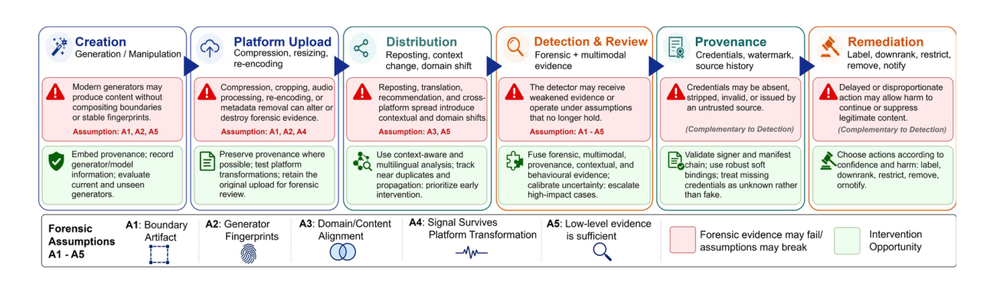
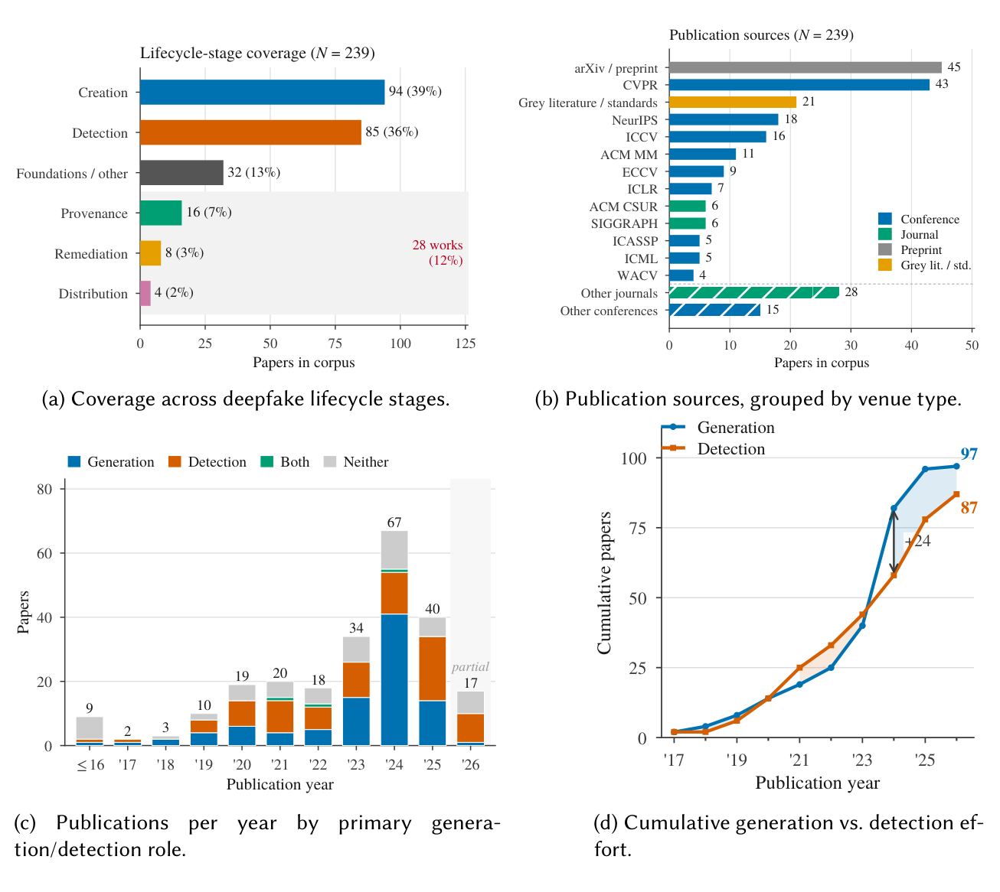
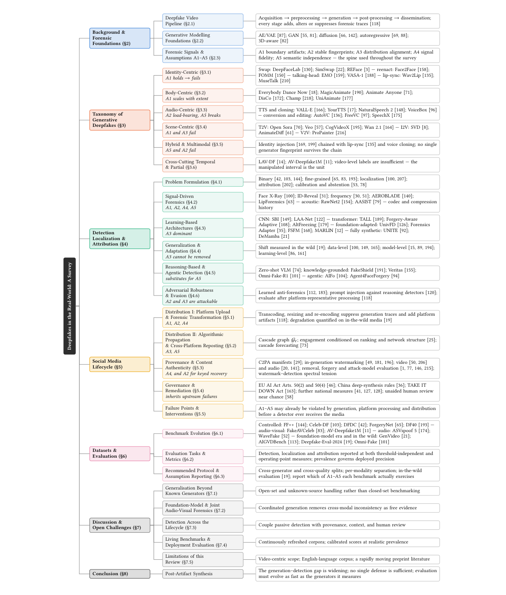
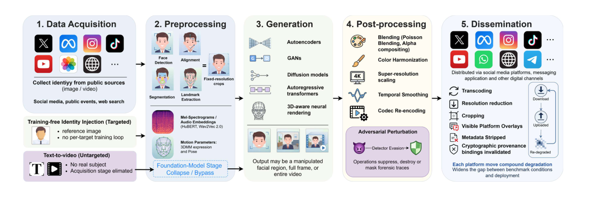
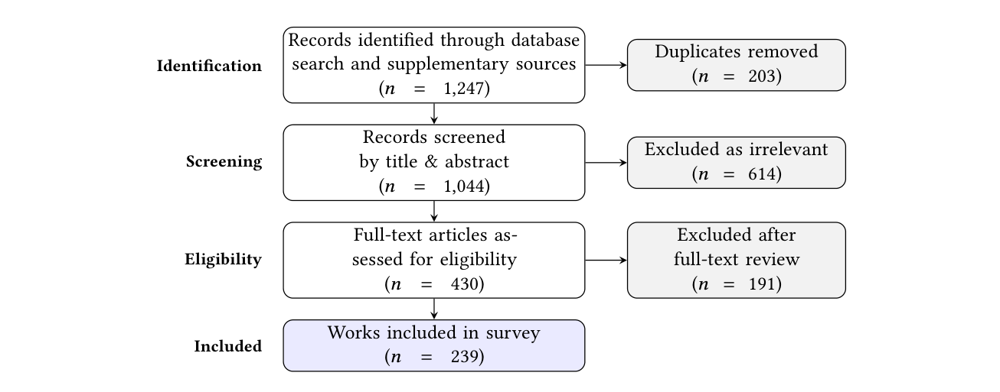

# Deepfake Detection Beyond the Lab: A Survey of Real-World Distribution, Forensics, and Provenance

[](https://github.com/VectorInstitute/deepfakes-survey-2026)
[](https://vectorinstitute.github.io/deepfakes-survey-2026/)
[](#-papers-by-category)
[](LICENSE)
[](CONTRIBUTING.md)

---

<div align="center">
  
  <p><em>The deepfake lifecycle, its forensic failure points, and the intervention opportunities at each stage. Generation, platform processing, and distribution may alter or remove forensic evidence long before a detector ever receives the media.</em></p>
</div>

## 🌟 Overview

Welcome to the companion repository for our survey on **real-world deepfake detection**. Deepfake detection is usually measured on curated benchmarks, yet most synthetic video reaches an audience through social media platforms that compress, resize, re-encode, crop, and repost it long before any detector sees it.

The practical question is therefore not whether a detector separates real from fake under laboratory conditions, but **whether the evidence it depends on still exists at the moment a decision has to be made**.

**Authors:** Shaina Raza¹, Jesse Ho¹, Ahmed Radwan¹, Mohamed Hafez¹, Graham Taylor¹

¹Vector Institute for Artificial Intelligence

| | |
|---|---|
| **Corpus** | 239 works, 72% peer-reviewed, median publication year 2024 |
| **Search window** | January 2017 – August 2026 |
| **Databases** | IEEE Xplore · ACM DL · SpringerLink · ScienceDirect · OpenReview · PMLR · AAAI DL · arXiv |
| **Scope** | Audio-video deepfakes, from generation through platform distribution to remediation |

---

## What does "beyond the lab" mean?

A deepfake is not simply a video to classify. It passes through a lifecycle of creation, upload, platform processing, recommendation, viewing, reporting, review, and eventual removal, labelling, or continued spread. Media transformations within that lifecycle — compression, re-encoding, cropping, reposting — weaken or alter the very forensic traces that detectors rely on.

This survey treats the whole chain as one problem:

- **Generation** — an evidence-based taxonomy linking manipulation types to the forensic traces they leave
- **Distribution** — platform processing and algorithmic propagation as transformations *on evidence*
- **Detection** — signal-driven, learning-based, reasoning-based, agentic, and adversarially robust methods
- **Provenance** — content credentials and watermarking, and where each one fails
- **Remediation** — disclosure and takedown regulation, and what it inherits from upstream failures

---

## 📊 The evidence gap

<div align="center">
  
  <p><em>Overview of the reviewed corpus. (a) Creation and detection account for three quarters of the corpus. (b) Publication sources by venue type. (c) Publications per year by primary role; the 2026 bar is partial. (d) Cumulative effort: detection led through 2023, but generation led by 24 works in 2024.</em></p>
</div>

**Key trends:**

- **Coverage imbalance** — Creation (39%) and detection (36%) account for **75%** of the corpus, while distribution (2%), provenance (7%), and remediation (3%) together account for **12%**. The stages that determine what evidence survives to a detector are the stages the field has studied least.
- **Generation is pulling ahead** — Cumulative generation research overtook detection research by 24 works in 2024.
- **Benchmarks do not transfer** — Open-source video detectors lose roughly **half their AUC** on contemporary circulated media relative to their original benchmarks.
- **Prevalence dominates deployment** — At 0.1% synthetic-media prevalence, a detector with 90% TPR and 1% FPR reaches only about **8.3% precision**. Threshold-independent AUC hides this entirely.

---

## 🔑 The Five Forensic Assumptions

Detectors rely on assumptions about the evidence available to them. We group these expectations into five assumptions, **A1–A5**, which form the analytical spine of the survey. Every section states which assumptions the methods it reviews depend on — and which ones fail.

| | Assumption | What it buys a detector | When it fails |
|:---:|---|---|---|
| **A1** | A manipulated region leaves a **boundary** | Compositing seams; texture, colour, resolution and compression mismatch at the edit border | Fully synthetic video — every pixel is generated, so there is nothing to composite against |
| **A2** | A generator leaves a **stable fingerprint** | Upsampling traces, spectral signatures, VAE-decoder bias, vocoder residuals; supports attribution | Generators are chained, fine-tuned, quantized, or distilled — no single fingerprint survives the chain |
| **A3** | Test videos **resemble the training data** | Supervised discriminative power on the manipulation types seen during training | New generators, identities, languages, or platforms appear after training — the default in deployment |
| **A4** | Forensic signals **survive processing** | Low-level evidence that is still measurable at decision time | Media passes through platform pipelines; the smallest edited regions degrade earliest |
| **A5** | **Low-level clues are enough** | Pixels, textures, frequencies, frame-level motion, cross-modal mismatch | Audio and video are generated jointly — the two channels agree by construction |

> **Reading the A1–A5 labels.** They mean different things in different contexts. For *generation*, they report whether an assumption holds for a method's outputs. For *detection*, whether a method depends on an assumption or mitigates its failure. For *datasets*, which assumptions a benchmark can stress-test.

**How the assumptions fail, in order.** `A1` goes with the seam — it survives localized editing and disappears once every pixel is synthetic. `A2` outlives it, but fails wherever generators are chained. `A5` is what jointly generated audio and video remove. `A3` and `A4` are not properties of the manipulation at all: they are set by what a detector was trained on, and by what the media has been through since.

---

## 🗺️ Survey structure

<div align="center">
  
  <p><em>Structure of this survey. Each leaf lists representative works and, where applicable, the forensic assumptions most relevant to that subsection.</em></p>
</div>

---

## 🏗️ The deepfake attack pipeline

<div align="center">
  
  <p><em>The deepfake video pipeline spanning data acquisition, preprocessing, generation, post-processing, and dissemination. Annotations indicate how forensic traces are introduced, modified, suppressed, or degraded across stages.</em></p>
</div>

The data cost of a convincing target has collapsed. Traditional face-swap systems required hundreds or thousands of identity-specific frames and per-target training. Training-free identity injection now operates from **a single reference image**, and text-to-video foundation models generate realistic synthetic individuals with **no target-specific data at all**.

---

## 🔄 What platforms do to the evidence

Most platform effects on forensic evidence are **asserted rather than measured**. The empty cells below are themselves a finding.

| Transformation | Stage | Affects | Reported effect | Evidence |
|---|---|:---:|---|:---:|
| Transcoding & re-encoding | Upload | `A2 A4` | Suppresses generation traces and introduces codec artifacts the detector must separate from them | **Measured** |
| Resolution reduction & resizing | Upload | `A1 A4` | Weakens localized blending boundaries first; smallest edited regions degrade earliest | **Measured** |
| Cropping & visible overlays | Upload, repost | `A1 A3` | Removes boundary regions and surrounding context; changes detector input framing | Described |
| Metadata stripping | Upload | — | Invalidates manifest binding; recovery falls back to durable credentials | Described |
| Audio transcoding & resampling | Upload | `A2 A4` | Alters vocoder and neural-codec residuals used by acoustic detectors | Partial |
| Repeated download & reupload | Cross-platform | `A2 A4` | Compounds the above; no reported degradation curve over repost depth | *Not measured* |
| Screen recording | Repost | `A1 A2 A4` | Full resample; removes compression history entirely | *Not measured* |
| Cross-platform, cross-language reach | Distribution | `A3 A5` | Moves media outside the training distribution and separates it from interpretive context | Described |
| **End-to-end in-the-wild effect** | All | `A2–A5` | Open-source video detectors lose approximately half their benchmark AUC on circulated media | **Measured** |

---

## 🔎 Literature screening

<div align="center">
  
  <p><em>Literature screening and selection process: 1,247 records identified, 239 works included.</em></p>
</div>

---

## 📖 Papers by Category

Every one of the survey's **220 bibliography entries** appears below, organized by the role it plays in the argument. A work cited in more than one role is listed under each. Entries are ordered newest-first within a subsection, and blockquotes name the forensic assumptions most relevant to that group.

> The reviewed **corpus** is 239 works; the **bibliography** carries 220 numbered references, since some corpus items are counted as a series (the ASVspoof releases, for instance) or discussed only inside a table. This list follows the bibliography.

## 1. Generative Foundations & the Deepfake Pipeline

### 1.1 Generative Modelling Foundations

- [2024] **Autoregressive Image Generation Without Vector Quantization** *Tianhong Li et al.* [[paper](https://arxiv.org/abs/2406.11838)]
- [2024] **FLUX** *Black Forest Labs* [[paper](https://github.com/black-forest-labs/flux)]
- [2024] **Scaling Rectified Flow Transformers for High-Resolution Image Synthesis (Stable Diffusion 3)** *Patrick Esser et al.* [[paper](https://arxiv.org/abs/2403.03206)]
- [2024] **VideoPoet: A Large Language Model for Zero-Shot Video Generation** *Dan Kondratyuk et al.* [[paper](https://arxiv.org/abs/2312.14125)]
- [2023] **3D Gaussian Splatting for Real-Time Radiance Field Rendering** *Bernhard Kerbl et al.* [[paper](https://doi.org/10.1145/3592433)]
- [2023] **Align Your Latents: High-Resolution Video Synthesis with Latent Diffusion Models** *Andreas Blattmann et al.* [[paper](https://doi.org/10.1109/cvpr52729.2023.02161)]
- [2023] **CogVideo: Large-Scale Pretraining for Text-to-Video Generation via Transformers** *Wenyi Hong et al.* [[paper](https://arxiv.org/abs/2205.15868)]
- [2022] **High-Resolution Image Synthesis with Latent Diffusion Models** *Robin Rombach et al.* [[paper](https://arxiv.org/abs/2112.10752)]
- [2022] **Video Diffusion Models** *Jonathan Ho et al.* [[paper](https://arxiv.org/abs/2204.03458)]
- [2021] **Alias-Free Generative Adversarial Networks (StyleGAN3)** *Tero Karras et al.* [[paper](https://arxiv.org/abs/2106.12423)]
- [2020] **Denoising Diffusion Probabilistic Models** *Jonathan Ho et al.* [[paper](https://arxiv.org/abs/2006.11239)]
- [2019] **A Style-Based Generator Architecture for Generative Adversarial Networks (StyleGAN)** *Tero Karras et al.* [[paper](https://doi.org/10.1109/cvpr.2019.00453)]
- [2014] **Auto-Encoding Variational Bayes** *Diederik P. Kingma et al.* [[paper](https://arxiv.org/abs/1312.6114)]
- [2014] **Generative Adversarial Nets** *Ian Goodfellow et al.* [[paper](https://arxiv.org/abs/1406.2661)]
- [1999] **A Morphable Model for the Synthesis of 3D Faces (3DMM)** *Volker Blanz et al.* [[paper](https://doi.org/10.1145/311535.311556)]

### 1.2 Video Foundation Models

> `A1` and `A3` fail — a fully synthetic frame has no authentic region to composite against, and new generators fall outside any training distribution.

- [2026] **Veo 3.1 (Gemini API)** *Google* [[paper](https://ai.google.dev/gemini-api/docs/video)]
- [2025] **Kling-Omni Technical Report** *Kling Team et al.* [[paper](https://arxiv.org/abs/2512.16776)]
- [2025] **Wan: Open and Advanced Large-Scale Video Generative Models** *Team Wan et al.* [[paper](https://arxiv.org/abs/2503.20314)]
- [2024] **CogVideoX: Text-to-Video Diffusion Models with an Expert Transformer** *Zhuoyi Yang et al.* [[paper](https://arxiv.org/abs/2408.06072)]
- [2024] **Emu Video: Factorizing Text-to-Video Generation by Explicit Image Conditioning** *Rohit Girdhar et al.* [[paper](https://arxiv.org/abs/2311.10709)]
- [2024] **Gen-3 Alpha** *Runway* [[paper](https://runwayml.com/research/gen-3-alpha)]
- [2024] **HunyuanVideo: A Systematic Framework for Large Video Generative Models** *Weijie Kong et al.* [[paper](https://arxiv.org/abs/2412.03603)]
- [2024] **LTX-Video: Realtime Video Latent Diffusion** *Yoav HaCohen et al.* [[paper](https://arxiv.org/abs/2501.00103)]
- [2024] **Lumiere: A Space-Time Diffusion Model for Video Generation** *Omer Bar-Tal et al.* [[paper](https://doi.org/10.1145/3680528.3687614)]
- [2024] **Movie Gen: A Cast of Media Foundation Models** *Adam Polyak et al.* [[paper](https://arxiv.org/abs/2410.13720)]
- [2024] **Open-Sora: Democratizing Efficient Video Production for All** *HPC-AI Tech* [[paper](https://github.com/hpcaitech/Open-Sora)]
- [2024] **Pika 2.0** *Pika Labs* [[paper](https://pika.art/)]
- [2024] **Veo: High-Fidelity Video Generation Model** *Google DeepMind* [[paper](https://deepmind.google/technologies/veo)]
- [2023] **AnimateDiff: Animate Your Personalized Text-to-Image Diffusion Models Without Specific Tuning** *Yuwei Guo et al.* [[paper](https://arxiv.org/abs/2307.04725)]
- [2023] **Stable Video Diffusion: Scaling Latent Video Diffusion Models to Large Datasets** *Andreas Blattmann et al.* [[paper](https://arxiv.org/abs/2311.15127)]

### 1.3 Media Preprocessing Building Blocks

- [2020] **RetinaFace: Single-Shot Multi-Level Face Localisation in the Wild** *Jiankang Deng et al.* [[paper](https://doi.org/10.1109/cvpr42600.2020.00525)]
- [2020] **wav2vec 2.0: A Framework for Self-Supervised Learning of Speech Representations** *Alexei Baevski et al.* [[paper](https://arxiv.org/abs/2006.11477)]
- [2019] **ArcFace: Additive Angular Margin Loss for Deep Face Recognition** *Jiankang Deng et al.* [[paper](https://doi.org/10.1109/cvpr.2019.00482)]
- [2016] **MTCNN: Joint Face Detection and Alignment Using Multitask Cascaded Convolutional Networks** *Kaipeng Zhang et al.* [[paper](https://doi.org/10.1109/lsp.2016.2603342)]

---

## 2. Taxonomy of Generative Deepfakes

### 2.1 Identity-Centric — Face Swapping

> `A1` holds while a generated face is composited into a real frame, and the generator family decides what else survives (`A2`).

- [2025] **DiffFace: Diffusion-Based Face Swapping with Facial Guidance** *Kihong Kim et al.* [[paper](https://doi.org/10.1016/j.patcog.2025.111451)]
- [2025] **DreamID: High-Fidelity and Fast Diffusion-Based Face Swapping via Triplet ID Group Learning** *Fulong Ye et al.* [[paper](https://doi.org/10.1145/3757377.3763963)]
- [2025] **DynamicFace: High-Quality and Consistent Face Swapping Using Composable 3D Facial Priors** *Runqi Wang et al.* [[paper](https://doi.org/10.1109/iccv51701.2025.01248)]
- [2025] **REFace: Realistic and Efficient Face Swapping with Diffusion Models** *Sanoojan Baliah et al.* [[paper](https://arxiv.org/abs/2409.07269)]
- [2024] **HiFiVFS: High Fidelity Video Face Swapping** *Chen Xu et al.* [[paper](https://arxiv.org/abs/2411.18293)]
- [2024] **ImplicitDeepfake: Face-Swapping Through Implicit Generation Using NeRF and Gaussian Splatting** *Mikołaj Pijarowski et al.* [[paper](https://arxiv.org/abs/2402.06390)]
- [2023] **DiffSwap: High-Fidelity and Controllable Face Swapping via 3D-Aware Masked Diffusion** *Wenliang Zhao et al.* [[paper](https://doi.org/10.1109/cvpr52729.2023.00828)]
- [2023] **FaceDancer: Pose- and Occlusion-Aware High Fidelity Face Swapping** *Felix Rosberg et al.* [[paper](https://doi.org/10.1109/wacv56688.2023.00345)]
- [2023] **InSwapper (InsightFace)** *InsightFace* [[paper](https://github.com/deepinsight/insightface)]
- [2021] **HifiFace: 3D Shape and Semantic Prior Guided High Fidelity Face Swapping** *Yuhan Wang et al.* [[paper](https://arxiv.org/abs/2106.09965)]
- [2020] **DeepFaceLab: Integrated, Flexible and Extensible Face-Swapping Framework** *Ivan Perov et al.* [[paper](https://arxiv.org/abs/2005.05535)]
- [2020] **FaceShifter: Advancing High Fidelity Identity Swapping for Forgery Detection** *Lingzhi Li et al.* [[paper](https://doi.org/10.1109/cvpr42600.2020.00512)]
- [2020] **SimSwap: An Efficient Framework for High Fidelity Face Swapping** *Renwang Chen et al.* [[paper](https://arxiv.org/abs/2106.06340)]
- [2019] **FSGAN: Subject Agnostic Face Swapping and Reenactment** *Yuval Nirkin et al.* [[paper](https://doi.org/10.1109/iccv.2019.00728)]
- [2017] **FaceSwap: Deepfakes Software for All** *Deepfakes Contributors* [[paper](https://github.com/deepfakes/faceswap)]

### 2.2 Identity-Centric — Facial Reenactment

> Nothing is pasted in, so `A1` weakens: the evidence is motion, not a seam.

- [2025] **DiffusionAct: Controllable Diffusion Autoencoder for One-Shot Face Reenactment** *Stella Bounareli et al.* [[paper](https://doi.org/10.1109/fg61629.2025.11099159)]
- [2024] **EmoPortraits: Emotion-Enhanced Multimodal One-Shot Head Avatars** *Nikita Drobyshev et al.* [[paper](https://doi.org/10.1109/cvpr52733.2024.00812)]
- [2024] **LivePortrait: Efficient Portrait Animation with Stitching and Retargeting Control** *Jianzhu Guo et al.* [[paper](https://arxiv.org/abs/2407.03168)]
- [2022] **Depth-Aware Generative Adversarial Network for Talking Head Video Generation (DaGAN)** *Fa-Ting Hong et al.* [[paper](https://doi.org/10.1109/cvpr52688.2022.00339)]
- [2022] **StyleGAN-V: A Continuous Video Generator with the Price, Image Quality and Perks of StyleGAN2** *Ivan Skorokhodov et al.* [[paper](https://doi.org/10.1109/cvpr52688.2022.00361)]
- [2022] **TPSMM: Thin-Plate Spline Motion Model for Image Animation** *Jian Zhao et al.* [[paper](https://doi.org/10.1109/cvpr52688.2022.00364)]
- [2020] **Neural Voice Puppetry: Audio-Driven Facial Reenactment** *Justus Thies et al.* [[paper](https://doi.org/10.1007/978-3-030-58517-4_42)]
- [2019] **FOMM: First Order Motion Model for Image Animation** *Aliaksandr Siarohin et al.* [[paper](https://arxiv.org/abs/2003.00196)]
- [2018] **MoCoGAN: Decomposing Motion and Content for Video Generation** *Sergey Tulyakov et al.* [[paper](https://doi.org/10.1109/cvpr.2018.00165)]
- [2016] **Face2Face: Real-Time Face Capture and Reenactment of RGB Videos** *Justus Thies et al.* [[paper](https://doi.org/10.1109/cvpr.2016.262)]

### 2.3 Identity-Centric — Talking-Head Synthesis

> When the full portrait is generated, `A1` no longer applies and only temporal and audio-visual consistency remain.

- [2025] **EchoMimic: Lifelike Audio-Driven Portrait Animations Through Editable Landmark Conditions** *Zhiyuan Chen et al.* [[paper](https://doi.org/10.1609/aaai.v39i3.32241)]
- [2025] **Hallo3: Highly Dynamic and Realistic Portrait Image Animation with Video Diffusion Transformer** *Jiahao Cui et al.* [[paper](https://doi.org/10.1109/cvpr52734.2025.01964)]
- [2024] **AniPortrait: Audio-Driven Synthesis of Photorealistic Portrait Animations** *Huawei Wei et al.* [[paper](https://arxiv.org/abs/2403.17694)]
- [2024] **EMO: Emote Portrait Alive — Generating Expressive Portrait Videos with Audio2Video Diffusion** *Linrui Tian et al.* [[paper](https://doi.org/10.1007/978-3-031-73010-8_15)]
- [2024] **GaussianTalker: Real-Time Talking Head Synthesis with 3D Gaussian Splatting** *Kyusun Cho et al.* [[paper](https://doi.org/10.1145/3664647.3681627)]
- [2024] **V-Express: Conditional Dropout for Progressive Training of Portrait Video Generation** *Cong Wang et al.* [[paper](https://arxiv.org/abs/2406.02511)]
- [2024] **VASA-1: Lifelike Audio-Driven Talking Faces Generated in Real Time** *Sicheng Xu et al.* [[paper](https://arxiv.org/abs/2404.10667)]
- [2023] **ER-NeRF: Efficient Region-Aware Neural Radiance Fields for High-Fidelity Talking Portrait Synthesis** *Jiahe Li et al.* [[paper](https://doi.org/10.1109/iccv51070.2023.00696)]
- [2023] **GeneFace: Generalized and High-Fidelity Audio-Driven 3D Talking Face Synthesis** *Zhenhui Ye et al.* [[paper](https://arxiv.org/abs/2301.13430)]
- [2023] **SadTalker: Learning Realistic 3D Motion Coefficients for Stylized Audio-Driven Single Image Talking Face Animation** *Wenxuan Zhang et al.* [[paper](https://doi.org/10.1109/cvpr52729.2023.00836)]
- [2021] **AD-NeRF: Audio Driven Neural Radiance Fields for Talking Head Synthesis** *Yudong Guo et al.* [[paper](https://doi.org/10.1109/iccv48922.2021.00573)]
- [2021] **Audio2Head: Audio-Driven One-Shot Talking-Head Generation with Natural Head Motion** *Suzhen Wang et al.* [[paper](https://doi.org/10.24963/ijcai.2021/152)]
- [2020] **MakeItTalk: Speaker-Aware Talking-Head Animation** *Yang Zhou et al.* [[paper](https://arxiv.org/abs/2004.12992)]

### 2.4 Identity-Centric — Lip-Sync Manipulation

> `A1` holds only around the mouth, and `A4` is especially fragile — compression erases small-region traces first.

- [2024] **Diff2Lip: Audio-Conditioned Diffusion Models for Lip-Synchronization** *Rudrabha Mukhopadhyay et al.* [[paper](https://arxiv.org/abs/2308.09716)]
- [2024] **MuseTalk: Real-Time High-Fidelity Video Dubbing via Spatio-Temporal Sampling** *Yue Zhang et al.* [[paper](https://arxiv.org/abs/2410.10122)]
- [2022] **VideoReTalking: Audio-Based Lip Synchronization for Talking Head Video Editing in the Wild** *Kun Cheng et al.* [[paper](https://doi.org/10.1145/3550469.3555399)]
- [2020] **Wav2Lip: A Lip Sync Expert Is All You Need for Speech to Lip Generation in the Wild** *KR Prajwal et al.* [[paper](https://doi.org/10.1145/3394171.3413532)]

### 2.5 Body-Centric Manipulations

> `A1` scales with extent: as the edit grows from a local seam to full-frame synthesis, the boundary disappears.

- [2025] **UniAnimate: Taming Unified Video Diffusion Models for Consistent Human Image Animation** *Xiang Wang et al.* [[paper](https://doi.org/10.1007/s11432-024-4592-3)]
- [2024] **Animate Anyone: Consistent and Controllable Image-to-Video Synthesis for Character Animation** *Li Hu et al.* [[paper](https://doi.org/10.1109/cvpr52733.2024.00779)]
- [2024] **Champ: Controllable and Consistent Human Image Animation with 3D Parametric Guidance** *Shenhao Zhu et al.* [[paper](https://doi.org/10.1007/978-3-031-73001-6_9)]
- [2024] **DisCo: Disentangled Control for Realistic Human Dance Generation** *Tan Wang et al.* [[paper](https://doi.org/10.1109/cvpr52733.2024.00891)]
- [2024] **MagicAnimate: Temporally Consistent Human Image Animation Using Diffusion Model** *Zhongcong Xu et al.* [[paper](https://doi.org/10.1109/cvpr52733.2024.00147)]
- [2019] **Everybody Dance Now** *Caroline Chan et al.* [[paper](https://arxiv.org/abs/1808.07371)]

### 2.6 Audio-Centric Manipulations

> `A2` is load-bearing — audio has no spatial boundary — and `A5` breaks when a manipulated channel is paired with an authentic one.

- [2024] **NaturalSpeech 2: Latent Diffusion Models Are Natural and Zero-Shot Speech and Singing Synthesizers** *Kai Shen et al.* [[paper](https://arxiv.org/abs/2304.09116)]
- [2024] **SpeechX: Neural Codec Language Model as a Versatile Speech Transformer** *Xiaofei Wang et al.* [[paper](https://doi.org/10.1109/taslp.2024.3419418)]
- [2023] **FreeVC: Towards High-Quality Text-Free One-Shot Voice Conversion** *Jingyi Li et al.* [[paper](https://doi.org/10.1109/icassp49357.2023.10095191)]
- [2023] **VALL-E: Neural Codec Language Models Are Zero-Shot Text-to-Speech Synthesizers** *Chengyi Wang et al.* [[paper](https://arxiv.org/abs/2301.02111)]
- [2023] **Voicebox: Text-Guided Multilingual Universal Speech Generation at Scale** *Matthew Le et al.* [[paper](https://arxiv.org/abs/2306.15687)]
- [2022] **YourTTS: Zero-Shot Multi-Speaker TTS and Zero-Shot Voice Conversion for Everyone** *Edresson Casanova et al.* [[paper](https://arxiv.org/abs/2112.02418)]
- [2021] **Speech Resynthesis from Discrete Disentangled Self-Supervised Representations** *Adam Polyak et al.* [[paper](https://arxiv.org/abs/2104.00355)]
- [2019] **AutoVC: Zero-Shot Voice Style Transfer with Only Autoencoder Loss** *Kaizhi Qian et al.* [[paper](https://arxiv.org/abs/1905.05879)]
- [2018] **SV2TTS: Transfer Learning from Speaker Verification to Multispeaker Text-to-Speech Synthesis** *Ye Jia et al.* [[paper](https://arxiv.org/abs/1806.04558)]

### 2.7 Scene-Centric — Editing and Inpainting

> `A1` holds for local edits and fails for global transformations, where boundaries are diffuse.

- [2025] **VACE: All-in-One Video Creation and Editing** *Zeyinzi Jiang et al.* [[paper](https://doi.org/10.1109/iccv51701.2025.01597)]
- [2024] **InstructVid2Vid: Controllable Video Editing with Natural Language Instructions** *Bosheng Qin et al.* [[paper](https://doi.org/10.1109/icme57554.2024.10687529)]
- [2023] **ProPainter: Improving Propagation and Transformer for Video Inpainting** *Shangchen Zhou et al.* [[paper](https://doi.org/10.1109/iccv51070.2023.00961)]

### 2.8 Hybrid & Multimodal Pipelines

> `A5` and `A2` fail — no single generator fingerprint survives a chain of identity injection, lip-sync, and voice cloning.

- [2024] **InstantID: Zero-Shot Identity-Preserving Generation in Seconds** *Qixun Wang et al.* [[paper](https://arxiv.org/abs/2401.07519)]
- [2023] **IP-Adapter: Text-Compatible Image Prompt Adapter for Text-to-Image Diffusion Models** *Hu Ye et al.* [[paper](https://arxiv.org/abs/2308.06721)]

---

## 3. Detection, Localization & Attribution

### 3.1 Signal-Driven Forensics

> Depends on `A1`, `A2`, `A4`, `A5`.

- [2025] **AVENUE: Deepfake Detection Based on Temporal Convolutional Networks and rPPG Information** *Lokendra Birla et al.* [[paper](https://doi.org/10.1145/3702232)]
- [2024] **AEROBLADE: Training-Free Detection of Latent Diffusion Images Using Autoencoder Reconstruction Error** *Jonas Ricker et al.* [[paper](https://doi.org/10.1109/cvpr52733.2024.00872)]
- [2024] **DiMoDif: Discourse Modality-Information Differentiation for Audio-Visual Deepfake Detection and Localization** *Christos Koutlis et al.* [[paper](https://arxiv.org/abs/2411.10193)]
- [2024] **Lips Are Lying: Spotting the Temporal Inconsistency Between Audio and Visual in Lip-Syncing Deepfakes (AVLips)** *Weifeng Liu et al.* [[paper](https://arxiv.org/abs/2401.15668)]
- [2023] **On the Detection of Synthetic Images Generated by Diffusion Models** *Riccardo Corvi et al.* [[paper](https://doi.org/10.1109/icassp49357.2023.10095167)]
- [2023] **Self-Supervised Video Forensics by Audio-Visual Anomaly Detection** *Chao Feng et al.* [[paper](https://doi.org/10.1109/cvpr52729.2023.01011)]
- [2022] **AASIST: Audio Anti-Spoofing Using Integrated Spectro-Temporal Graph Attention Networks** *Jee-weon Jung et al.* [[paper](https://doi.org/10.1109/icassp43922.2022.9747766)]
- [2021] **ID-Reveal: Identity-Aware DeepFake Video Detection** *Davide Cozzolino et al.* [[paper](https://doi.org/10.1109/iccv48922.2021.01483)]
- [2021] **Learning Self-Consistency for Deepfake Detection** *Tianchen Zhao et al.* [[paper](https://doi.org/10.1109/iccv48922.2021.01475)]
- [2021] **Lips Don't Lie: A Generalisable and Robust Approach to Face Forgery Detection (LipForensics)** *Alexandros Haliassos et al.* [[paper](https://doi.org/10.1109/cvpr46437.2021.00500)]
- [2021] **RawNet2: End-to-End Anti-Spoofing** *Hemlata Tak et al.* [[paper](https://doi.org/10.1109/icassp39728.2021.9414234)]
- [2021] **Spatial-Phase Shallow Learning: Rethinking Face Forgery Detection in Frequency Domain** *Honggu Liu et al.* [[paper](https://doi.org/10.1109/cvpr46437.2021.00083)]
- [2020] **F3-Net: Thinking in Frequency — Face Forgery Detection by Mining Frequency-Aware Clues** *Yuyang Qian et al.* [[paper](https://doi.org/10.1007/978-3-030-58610-2_6)]
- [2020] **Face X-Ray for More General Face Forgery Detection** *Lingzhi Li et al.* [[paper](https://doi.org/10.1109/cvpr42600.2020.00505)]
- [2020] **Leveraging Frequency Analysis for Deep Fake Image Recognition** *Joel Frank et al.* [[paper](https://arxiv.org/abs/2003.08685)]
- [2020] **Watch Your Up-Convolution: CNN-Based Generative Deep Neural Networks Are Failing to Reproduce Spectral Distributions** *Ricard Durall et al.* [[paper](https://doi.org/10.1109/cvpr42600.2020.00791)]
- [2016] **Out of Time: Automated Lip Sync in the Wild (SyncNet)** *Joon Son Chung et al.* [[paper](https://doi.org/10.1007/978-3-319-54427-4_19)]
- [2012] **An Overview on Video Forensics** *Simone Milani et al.* [[paper](https://doi.org/10.1017/ATSIP.2012.2)]
- [2009] **Image Forgery Detection** *Hany Farid* [[paper](https://doi.org/10.1109/MSP.2008.931079)]

### 3.2 Learning-Based Architectures

> `A3` dominant.

- [2026] **AIGVDBench: Your One-Stop Solution for AI-Generated Video Detection** *Long Ma et al.* [[paper](https://arxiv.org/abs/2601.11035)]
- [2026] **Deepfake Detection That Generalizes Across Benchmarks** *Andrii Yermakov et al.* [[paper](https://doi.org/10.1109/wacv61042.2026.00082)]
- [2026] **DeMamba: AI-Generated Video Detection on Million-Scale GenVideo Benchmark** *Haoxing Chen et al.* [[paper](https://doi.org/10.1007/s11432-024-4894-0)]
- [2025] **Deepfake-Adapter: Dual-Level Adapter for Deepfake Detection** *Rui Shao et al.* [[paper](https://doi.org/10.1007/s11263-024-02274-6)]
- [2025] **Detecting AI-Generated Video via Frame Consistency** *Long Ma et al.* [[paper](https://doi.org/10.1109/icme59968.2025.11210049)]
- [2025] **Forensics Adapter: Adapting CLIP for Generalizable Face Forgery Detection** *Xinjie Cui et al.* [[paper](https://doi.org/10.1109/cvpr52734.2025.01789)]
- [2025] **FSFM: A Generalizable Face Security Foundation Model via Self-Supervised Facial Representation Learning** *Gaojian Wang et al.* [[paper](https://doi.org/10.1109/cvpr52734.2025.02269)]
- [2025] **UNITE: Towards a Universal Synthetic Video Detector** *Rohit Kundu et al.* [[paper](https://doi.org/10.1109/cvpr52734.2025.02612)]
- [2024] **CLIPping the Deception: Adapting Vision-Language Models for Universal Deepfake Detection** *Sohail Ahmed Khan et al.* [[paper](https://doi.org/10.1145/3652583.3658035)]
- [2024] **Forgery-Aware Adaptive Transformer for Generalizable Synthetic Image Detection** *Huan Liu et al.* [[paper](https://doi.org/10.1109/cvpr52733.2024.01024)]
- [2024] **LAA-Net: Localized Artifact Attention Network for Quality-Agnostic and Generalizable Deepfake Detection** *Dat Nguyen et al.* [[paper](https://doi.org/10.1109/cvpr52733.2024.01647)]
- [2024] **On Learning Multi-Modal Forgery Representation for Diffusion-Generated Video Detection** *Xiufeng Song et al.* [[paper](https://arxiv.org/abs/2410.23623)]
- [2023] **AltFreezing for More General Video Face Forgery Detection** *Zhendong Wang et al.* [[paper](https://doi.org/10.1109/cvpr52729.2023.00402)]
- [2023] **Deepfake Detection Using EfficientNet and XceptionNet** *Basma Yasser et al.* [[paper](https://doi.org/10.1109/icicis58388.2023.10391114)]
- [2023] **MARLIN: Masked Autoencoder for Facial Video Representation Learning** *Zhixi Cai et al.* [[paper](https://doi.org/10.1109/cvpr52729.2023.00150)]
- [2023] **TALL: Thumbnail Layout for Deepfake Video Detection** *Yuting Xu et al.* [[paper](https://doi.org/10.1109/iccv51070.2023.02071)]
- [2023] **UnivFD: Towards Universal Fake Image Detectors That Generalize Across Generative Models** *Utkarsh Ojha et al.* [[paper](https://doi.org/10.1109/cvpr52729.2023.02345)]
- [2022] **SBI: Detecting Deepfakes with Self-Blended Images** *Kaede Shiohara et al.* [[paper](https://doi.org/10.1109/cvpr52688.2022.01816)]
- [2022] **UIA-ViT: Unsupervised Inconsistency-Aware Method Based on Vision Transformer for Face Forgery Detection** *Wanyi Zhuang et al.* [[paper](https://doi.org/10.1007/978-3-031-20065-6_23)]
- [2021] **Multi-Attentional Deepfake Detection** *Hanqing Zhao et al.* [[paper](https://doi.org/10.1109/cvpr46437.2021.00222)]
- [2019] **Use of a Capsule Network to Detect Fake Images and Videos** *Huy H Nguyen et al.* [[paper](https://arxiv.org/abs/1910.12467)]

### 3.3 Generalization & Adaptation

> `A3` cannot be removed — only broadened.

- [2025] **Deepfake-Eval-2024: A Multi-Modal In-the-Wild Benchmark of Deepfakes Circulated in 2024** *Nuria Alina Chandra et al.* [[paper](https://arxiv.org/abs/2503.02857)]
- [2025] **MoE-FFD: Mixture of Experts for Generalized and Parameter-Efficient Face Forgery Detection** *Chenqi Kong et al.* [[paper](https://doi.org/10.1109/tdsc.2025.3604443)]
- [2024] **Fake It Till You Make It: Curricular Dynamic Forgery Augmentations Towards General Deepfake Detection** *Yuzhen Lin et al.* [[paper](https://doi.org/10.1007/978-3-031-73016-0_7)]
- [2024] **Transcending Forgery Specificity with Latent Space Augmentation for Generalizable Deepfake Detection** *Zhiyuan Yan et al.* [[paper](https://doi.org/10.1109/cvpr52733.2024.00858)]
- [2023] **Curriculum-Based Augmented Fourier Domain Adaptation for Robust Medical Image Segmentation** *An Wang et al.* [[paper](https://doi.org/10.1109/tase.2023.3295600)]
- [2023] **SeeABLE: Soft Discrepancies and Bounded Contrastive Learning for Exposing Deepfakes** *Nicolas Larue et al.* [[paper](https://doi.org/10.1109/iccv51070.2023.01921)]
- [2023] **UCF: Uncovering Common Features for Generalizable Deepfake Detection** *Zhiyuan Yan et al.* [[paper](https://doi.org/10.1109/iccv51070.2023.02048)]
- [2022] **End-to-End Reconstruction-Classification Learning for Face Forgery Detection** *Junyi Cao et al.* [[paper](https://doi.org/10.1109/cvpr52688.2022.00408)]
- [2022] **Generalization of Forgery Detection with Meta Deepfake Detection Model** *Van-Nhan Tran et al.* [[paper](https://doi.org/10.1109/access.2022.3232290)]
- [2021] **CoReD: Generalizing Fake Media Detection with Continual Representation Using Distillation** *Minha Kim et al.* [[paper](https://doi.org/10.1145/3474085.3475535)]

### 3.4 Localization, Attribution & Calibration

> Attribution rests on `A2`; calibration and abstention matter because prevalence governs deployed precision.

- [2025] **Towards Reliable Deepfake Detection from an Uncertainty Calibration Perspective** *Xiaoxu Jin et al.* [[paper](https://doi.org/10.1007/s44267-025-00100-2)]
- [2023] **UMMAFormer: A Universal Multimodal-Adaptive Transformer Framework for Temporal Forgery Localization** *Rui Zhang et al.* [[paper](https://doi.org/10.1145/3581783.3613767)]
- [2021] **Artificial Fingerprinting for Generative Models: Rooting Deepfake Attribution in Training Data** *Ning Yu et al.* [[paper](https://doi.org/10.1109/iccv48922.2021.01418)]
- [2021] **ForgeryNet: A Versatile Benchmark for Comprehensive Forgery Analysis** *Yinan He et al.* [[paper](https://doi.org/10.1109/cvpr46437.2021.00434)]
- [2019] **Attributing Fake Images to GANs: Learning and Analyzing GAN Fingerprints** *Ning Yu et al.* [[paper](https://doi.org/10.1109/iccv.2019.00765)]
- [2017] **Selective Classification for Deep Neural Networks** *Yonatan Geifman et al.* [[paper](https://arxiv.org/abs/1705.08500)]

### 3.5 Reasoning-Based & Agentic Detection

> Substitutes semantic reasoning for `A5`.

- [2026] **Large Language Models in Digital Forensics: Capabilities, Challenges and Future Directions** *Maxim Chernyshev et al.* [[paper](https://doi.org/10.1016/j.fsidi.2025.302043)]
- [2026] **Omni-Fake: Benchmarking Unified Multimodal Social Media Deepfake Detection** *Tianxiao Li et al.* [[paper](https://arxiv.org/abs/2605.01638)]
- [2026] **Veritas: Generalizable Deepfake Detection via Pattern-Aware Reasoning** *Hao Tan et al.*
- [2025] **Agent4FaceForgery: Multi-Agent LLM Framework for Realistic Face Forgery Detection** *Yingxin Lai et al.* [[paper](https://arxiv.org/abs/2509.12546)]
- [2025] **FakeShield: Explainable Image Forgery Detection and Localization via Multi-Modal LLMs** *Zhipei Xu et al.* [[paper](https://arxiv.org/abs/2410.02761)]
- [2025] **From Evidence to Verdict: An Agent-Based Forensic Framework for AI-Generated Image Detection (AIFo)** *Mengfei Liang et al.* [[paper](https://arxiv.org/abs/2511.00181)]
- [2025] **Unlocking the Capabilities of Large Vision-Language Models for Generalizable and Explainable Deepfake Detection** *Peipeng Yu et al.* [[paper](https://arxiv.org/abs/2503.14853)]
- [2024] **Can ChatGPT Detect DeepFakes? Multimodal Large Language Models for Media Forensics** *Shan Jia et al.* [[paper](https://doi.org/10.1109/cvprw63382.2024.00436)]
- [2024] **Common Sense Reasoning for Deepfake Detection** *Yue Zhang et al.* [[paper](https://doi.org/10.1007/978-3-031-73223-2_22)]

### 3.6 Adversarial Robustness & Evasion

> `A2` and `A3` are attackable — evaluate after platform-representative processing.

- [2025] **Bridging the Gap: A Framework for Real-World Video Deepfake Detection via Social Network Compression Emulation** *Andrea Montibeller et al.* [[paper](https://doi.org/10.1145/3746265.3759670)]
- [2025] **GANFR: GAN Fingerprint Removal Network for Image Anti-Forensics** *Yihong Lu et al.* [[paper](https://doi.org/10.1016/j.knosys.2025.114134)]
- [2025] **Image-Based Prompt Injection: Hijacking Multimodal LLMs Through Visually Embedded Adversarial Instructions** *Neha Nagaraja et al.* [[paper](https://doi.org/10.1109/fllm67465.2025.11391218)]
- [2024] **Robustness of AI-Image Detectors: Fundamental Limits and Practical Attacks** *Mehrdad Saberi et al.* [[paper](https://arxiv.org/abs/2310.00076)]
- [2022] **Evading Generated-Image Detectors: A Deep Dithering Approach** *Hao Xie et al.* [[paper](https://doi.org/10.1016/j.sigpro.2022.108558)]
- [2020] **Evading Deepfake-Image Detectors with White- and Black-Box Attacks** *Nicholas Carlini et al.* [[paper](https://doi.org/10.1109/cvprw50498.2020.00337)]

---

## 4. The Social Media Lifecycle

### 4.1 Platform Upload & Forensic Transformation

> `A1`, `A2`, `A4` — transcoding, resizing, and re-encoding suppress generation traces and add platform artifacts of their own.

- [2025] **Bridging the Gap: A Framework for Real-World Video Deepfake Detection via Social Network Compression Emulation** *Andrea Montibeller et al.* [[paper](https://doi.org/10.1145/3746265.3759670)]
- [2025] **Deepfake-Eval-2024: A Multi-Modal In-the-Wild Benchmark of Deepfakes Circulated in 2024** *Nuria Alina Chandra et al.* [[paper](https://arxiv.org/abs/2503.02857)]
- [2025] **Global Social Media Statistics** *DataReportal* [[paper](https://datareportal.com/social-media-users)]
- [2025] **Most Popular Social Networks Worldwide (Feb 2025)** *Statista* [[paper](https://www.statista.com/statistics/272014/global-social-networks-ranked-by-number-of-users/)]

### 4.2 Algorithmic Propagation & Cross-Platform Reposting

> `A3`, `A5` — reach moves media outside any training distribution and separates it from interpretive context.

- [2026] **Multimodal Spatiotemporal Forecasting of Deepfake Propagation on Social Media** *Seoyoon Jeong et al.*
- [2021] **Causal Understanding of Fake News Dissemination on Social Media** *Lu Cheng et al.* [[paper](https://doi.org/10.1145/3447548.3467321)]

### 4.3 Provenance & Content Authenticity

> `A4`, and `A2` for keyed recovery.

- [2026] **C2PA Content Credentials: Technical Specification 2.3** *Coalition for Content Provenance and Authenticity* [[spec](https://spec.c2pa.org/specifications/specifications/2.3/specs/C2PA_Specification.html)]
- [2024] **AudioSeal: Proactive Detection of Voice Cloning with Localized Watermarking** *Robin San Roman et al.* [[paper](https://arxiv.org/abs/2401.17264)]
- [2024] **Gaussian Shading: Provable Performance-Lossless Image Watermarking for Diffusion Models** *Zijin Yang et al.* [[paper](https://doi.org/10.1109/cvpr52733.2024.01156)]
- [2024] **Video Seal: Open and Efficient Video Watermarking** *Pierre Fernandez et al.* [[paper](https://arxiv.org/abs/2412.09492)]
- [2023] **The Stable Signature: Rooting Watermarks in Latent Diffusion Models** *Pierre Fernandez et al.* [[paper](https://doi.org/10.1109/iccv51070.2023.02053)]
- [2023] **Tree-Ring Watermarks: Invisible Fingerprints for Diffusion Images** *Yuxin Wen et al.* [[paper](https://doi.org/10.52202/075280-2529)]
- [2023] **WavMark: Watermarking for Audio Generation** *Guangyu Chen et al.* [[paper](https://arxiv.org/abs/2308.12770)]
- [2021] **Artificial Fingerprinting for Generative Models: Rooting Deepfake Attribution in Training Data** *Ning Yu et al.* [[paper](https://doi.org/10.1109/iccv48922.2021.01418)]
- [2019] **RivaGAN: Robust Invisible Video Watermarking with Attention** *Kevin Alex Zhang et al.* [[paper](https://arxiv.org/abs/1909.01285)]

### 4.4 Watermark Removal, Forgery & Attack Models

- [2024] **AudioMarkBench: Benchmarking Robustness of Audio Watermarking** *Hongbin Liu et al.* [[paper](https://arxiv.org/abs/2406.06979)]
- [2024] **Invisible Image Watermarks Are Provably Removable Using Generative AI** *Xuandong Zhao et al.* [[paper](https://arxiv.org/abs/2306.01953)]
- [2024] **Robustness of AI-Image Detectors: Fundamental Limits and Practical Attacks** *Mehrdad Saberi et al.* [[paper](https://arxiv.org/abs/2310.00076)]
- [2024] **WAVES: Benchmarking the Robustness of Image Watermarks** *Bang An et al.* [[paper](https://arxiv.org/abs/2401.08573)]
- [2023] **Evading Watermark-Based Detection of AI-Generated Content** *Zhengyuan Jiang et al.* [[paper](https://doi.org/10.1145/3576915.3623189)]

### 4.5 Governance & Remediation

> Inherits every assumption that failed upstream.

- [2026] **Protecting Victims Act, Bill C-16 (Canada)** *Department of Justice Canada* [[spec](https://www.justice.gc.ca/eng/csj-sjc/pl/c16/index.html)]
- [2025] **Data (Use and Access) Act 2025, s.138 (United Kingdom)** *Parliament of the United Kingdom* [[spec](https://www.legislation.gov.uk/ukpga/2025/18/section/138)]
- [2025] **TAKE IT DOWN Act (United States)** *United States Congress* [[spec](https://www.congress.gov/bill/119th-congress/senate-bill/146)]
- [2024] **Criminal Code Amendment (Deepfake Sexual Material) Act 2024 (Australia)** *Parliament of Australia* [[spec](https://www.aph.gov.au/Parliamentary_Business/Bills_Legislation/Bills_Search_Results/Result?bId=r7205)]
- [2024] **Election Campaigns Using Deepfakes Restricted (South Korea, Public Official Election Act Art. 82-8)** *National Election Commission of the Republic of Korea* [[spec](https://www.nec.go.kr/site/eng/ex/bbs/View.do?bcIdx=226657&cbIdx=1270)]
- [2024] **EU AI Act — Regulation (EU) 2024/1689, Article 50** *European Parliament and Council of the European Union* [[spec](https://eur-lex.europa.eu/eli/reg/2024/1689/oj)]
- [2022] **Deepfake Detection by Human Crowds, Machines, and Machine-Informed Crowds** *Matthew Groh et al.* [[paper](https://doi.org/10.1073/pnas.2110013119)]
- [2022] **Provisions on the Administration of Deep Synthesis Internet Information Services (China)** *Cyberspace Administration of China et al.*

---

## 5. Datasets & Benchmarks

### 5.1 Video & Visual Benchmarks

- [2026] **AIGVDBench: Your One-Stop Solution for AI-Generated Video Detection** *Long Ma et al.* [[paper](https://arxiv.org/abs/2601.11035)]<br/>&nbsp;&nbsp;&nbsp;&nbsp;<sub>`A2–A4` — 20K real / 422K fake; 31 T2V/I2V/V2V models under unified H.264</sub>
- [2026] **DeMamba: AI-Generated Video Detection on Million-Scale GenVideo Benchmark** *Haoxing Chen et al.* [[paper](https://doi.org/10.1007/s11432-024-4894-0)]<br/>&nbsp;&nbsp;&nbsp;&nbsp;<sub>`A2 A3 A4` — 1.21M real / 1.08M fake; unseen-generator tests and 8 degradation types</sub>
- [2026] **TalkingHeadBench: A Multi-Modal Benchmark and Analysis of Talking-Head Deepfake Detection** *Xinqi Xiong et al.* [[paper](https://doi.org/10.1109/wacv61042.2026.00403)]<br/>&nbsp;&nbsp;&nbsp;&nbsp;<sub>`A1–A3 A5` — 2,312 real / 2,994 fake; identity-, generator-, and joint-shift protocols</sub>
- [2024] **DF40: Toward Next-Generation Deepfake Detection** *Zhiyuan Yan et al.* [[paper](https://arxiv.org/abs/2406.13495)]<br/>&nbsp;&nbsp;&nbsp;&nbsp;<sub>`A1–A3 A5` — 40 techniques; 9 methods reserved as unknown-domain test data</sub>
- [2021] **ForgeryNet: A Versatile Benchmark for Comprehensive Forgery Analysis** *Yinan He et al.* [[paper](https://doi.org/10.1109/cvpr46437.2021.00434)]<br/>&nbsp;&nbsp;&nbsp;&nbsp;<sub>`A1–A4` — 2.9M images / 221K videos; 15 manipulation methods with masks</sub>
- [2020] **Celeb-DF: A Large-Scale Challenging Dataset for DeepFake Forensics** *Yuezun Li et al.* [[paper](https://doi.org/10.1109/cvpr42600.2020.00327)]<br/>&nbsp;&nbsp;&nbsp;&nbsp;<sub>`A1 A3 A5` — 590 real / 5,639 fake; higher-quality celebrity face swaps</sub>
- [2020] **The DeepFake Detection Challenge (DFDC) Dataset** *Brian Dolhansky et al.* [[paper](https://arxiv.org/abs/2006.07397)]<br/>&nbsp;&nbsp;&nbsp;&nbsp;<sub>`A1–A4` — 23,654 real / 104,500 fake; 960 consenting subjects, some audio swaps</sub>
- [2020] **WildDeepfake: A Challenging Real-World Dataset for Deepfake Detection** *Bojia Zi et al.* [[paper](https://arxiv.org/abs/2101.01456)]<br/>&nbsp;&nbsp;&nbsp;&nbsp;<sub>`A2–A4` — 3,805 real / 3,509 fake collected online; generation methods unknown</sub>
- [2019] **FaceForensics++: Learning to Detect Manipulated Facial Images** *Andreas Rossler et al.* [[paper](https://doi.org/10.1109/iccv.2019.00009)]<br/>&nbsp;&nbsp;&nbsp;&nbsp;<sub>`A1 A2 A4` — 1,000 real / 4,000 fake; raw, HQ, and LQ compression conditions</sub>

### 5.2 Audio Benchmarks

- [2025] **CodecFake: Dataset and Countermeasures for the Universal Detection of Deepfake Audio** *Yuankun Xie et al.* [[paper](https://doi.org/10.1109/taslpro.2025.3525966)]<br/>&nbsp;&nbsp;&nbsp;&nbsp;<sub>`A2 A3 A5` — 132,277 real / 925,939 fake; 7 neural codecs, held-out codec test</sub>
- [2024] **ASVspoof 5: Crowdsourced Speech Data, Deepfakes, and Adversarial Attacks at Scale** *Xin Wang et al.* [[paper](https://arxiv.org/abs/2408.08739)]<br/>&nbsp;&nbsp;&nbsp;&nbsp;<sub>`A2–A5` — crowdsourced data, deepfakes, and adversarial attacks at scale</sub>
- [2022] **ASVspoof 2021: Towards Spoofed and Deepfake Speech Detection in the Wild** *Xuechen Liu et al.* [[paper](https://arxiv.org/abs/2210.02437)]<br/>&nbsp;&nbsp;&nbsp;&nbsp;<sub>`A2–A5` — adds codec/transmission and in-the-wild conditions</sub>
- [2021] **WaveFake: A Data Set to Facilitate Audio Deepfake Detection** *Joel Frank et al.* [[paper](https://arxiv.org/abs/2111.02813)]<br/>&nbsp;&nbsp;&nbsp;&nbsp;<sub>`A2 A3 A5` — 117,985 clips (~196 h); English LJSpeech and Japanese JSUT</sub>
- [2020] **ASVspoof 2019: A Large-Scale Public Database of Synthesized, Converted and Replayed Speech** *Xin Wang et al.* [[paper](https://doi.org/10.1016/j.csl.2020.101114)]<br/>&nbsp;&nbsp;&nbsp;&nbsp;<sub>`A2–A5` — TTS, VC, and replay attacks</sub>

### 5.3 Audio-Visual & Multimodal Benchmarks

- [2026] **AVFakeBench: A Comprehensive Audio-Video Forgery Detection Benchmark for AV-LMMs** *Shuhan Xia et al.*<br/>&nbsp;&nbsp;&nbsp;&nbsp;<sub>`A1–A3 A5` — 1,000 real / 2,000 fake, 12K QA pairs; 7 AV forgery combinations</sub>
- [2026] **DigiFakeAV: Beyond Face Swapping — A Diffusion-Based Digital Human Benchmark for Multimodal Deepfake Detection** *Jiaxin Liu et al.* [[paper](https://doi.org/10.1109/icassp55912.2026.11462517)]<br/>&nbsp;&nbsp;&nbsp;&nbsp;<sub>`A2–A5` — 10K real / 50K fake; 5 diffusion-based digital-human generators</sub>
- [2026] **The DeepSpeak Dataset** *Sarah Barrington et al.* [[paper](https://arxiv.org/abs/2408.05366)]<br/>&nbsp;&nbsp;&nbsp;&nbsp;<sub>`A1–A3 A5` — 16,043 real / 14,005 fake (>100 h); consented recordings, 14 video + 3 audio generators</sub>
- [2025] **AV-Deepfake1M++: A Large-Scale Audio-Visual Deepfake Benchmark with Real-World Perturbations** *Zhixi Cai et al.* [[paper](https://doi.org/10.1145/3746027.3761979)]<br/>&nbsp;&nbsp;&nbsp;&nbsp;<sub>`A1–A5` — ~2.05M videos; adds subjects, TTS/lip-sync models, perturbations, codec variation</sub>
- [2025] **MAVOS-DD: Multilingual Audio-Video Open-Set Deepfake Detection Benchmark** *Florinel-Alin Croitoru et al.* [[paper](https://arxiv.org/abs/2505.11109)]<br/>&nbsp;&nbsp;&nbsp;&nbsp;<sub>`A2 A3 A5` — 25,195 real / 35,169 fake (252.5 h); holds out both languages and generators</sub>
- [2024] **AV-Deepfake1M: A Large-Scale LLM-Driven Audio-Visual Deepfake Dataset** *Zhixi Cai et al.* [[paper](https://doi.org/10.1145/3664647.3680795)]<br/>&nbsp;&nbsp;&nbsp;&nbsp;<sub>`A1–A5` — ~1.15M videos; LLM-planned insertion, replacement, and deletion</sub>
- [2024] **Lips Are Lying: Spotting the Temporal Inconsistency Between Audio and Visual in Lip-Syncing Deepfakes (AVLips)** *Weifeng Liu et al.* [[paper](https://arxiv.org/abs/2401.15668)]<br/>&nbsp;&nbsp;&nbsp;&nbsp;<sub>`A1–A5` — up to 340K AV samples; 4 lip-sync generators, 6 perturbation types</sub>
- [2022] **LAV-DF: Content-Driven Audio-Visual Deepfake Dataset and Temporal Forgery Localization** *Zhixi Cai et al.* [[paper](https://doi.org/10.1109/dicta56598.2022.10034605)]<br/>&nbsp;&nbsp;&nbsp;&nbsp;<sub>`A1 A2 A5` — 36,431 real / 99,873 fake; short localized segment manipulations</sub>
- [2021] **FakeAVCeleb: A Novel Audio-Video Multimodal Deepfake Dataset** *Hasam Khalid et al.* [[paper](https://arxiv.org/abs/2108.05080)]<br/>&nbsp;&nbsp;&nbsp;&nbsp;<sub>`A1–A3 A5` — 500 real / 19,500 fake; 4 real/fake audio-video combinations</sub>

### 5.4 In-the-Wild & Foundation-Model-Era Benchmarks

- [2026] **Omni-Fake: Benchmarking Unified Multimodal Social Media Deepfake Detection** *Tianxiao Li et al.* [[paper](https://arxiv.org/abs/2605.01638)]<br/>&nbsp;&nbsp;&nbsp;&nbsp;<sub>`A1–A5` — >1M in-distribution / >200K OOD across four modalities</sub>
- [2025] **Deepfake-Eval-2024: A Multi-Modal In-the-Wild Benchmark of Deepfakes Circulated in 2024** *Nuria Alina Chandra et al.* [[paper](https://arxiv.org/abs/2503.02857)]<br/>&nbsp;&nbsp;&nbsp;&nbsp;<sub>`A2–A5` — in-the-wild media from 88 web sources across 52 languages, human forensic labels</sub>

---

## 6. Related Surveys

### 6.1 Deepfake Generation & Detection Surveys

- [2026] **A Comprehensive Review of Deepfake Detection Techniques** *Ahmad Raza et al.* [[paper](https://doi.org/10.3390/ai7020068)]
- [2026] **Deepfake Generation and Detection: A Benchmark and Survey** *Gan Pei et al.* [[paper](https://doi.org/10.1145/3801962)]
- [2026] **Understanding Audiovisual Deepfake Detection: Techniques, Challenges, Human Factors, and Perceptual Insights** *Ammarah Hashmi et al.* [[paper](https://doi.org/10.1109/mci.2026.3656145)]
- [2025] **DeepFake Detection in the AIGC Era: A Survey, Benchmarks, and Future Perspectives** *Shichuang Xie et al.* [[paper](https://doi.org/10.1016/j.inffus.2025.103740)]
- [2024] **Deepfake Detection: A Comprehensive Survey from the Reliability Perspective** *Tianyi Wang et al.* [[paper](https://doi.org/10.1145/3699710)]
- [2024] **Deepfake Media Generation and Detection in the Generative AI Era: A Survey and Outlook** *Florinel Alin Croitoru et al.* [[paper](https://doi.org/10.1145/3833867)]
- [2022] **DeepFake Detection for Human Face Images and Videos: A Survey** *Asad Malik et al.* [[paper](https://doi.org/10.1109/access.2022.3151186)]
- [2021] **The Creation and Detection of Deepfakes: A Survey** *Yisroel Mirsky et al.* [[paper](https://arxiv.org/abs/2004.11138)]
- [2020] **Deepfakes and Beyond: A Survey of Face Manipulation and Fake Detection** *Ruben Tolosana et al.* [[paper](https://doi.org/10.1016/j.inffus.2020.06.014)]

### 6.2 Proactive Defense & Provenance Surveys

- [2025] **A Survey on Proactive Deepfake Defense: Disruption and Watermarking** *Hong-Hanh Nguyen-Le et al.* [[paper](https://doi.org/10.36227/techrxiv.175372553.34689335/v1)]

---

## 🔬 Research gaps & open challenges

Our analysis surfaces six problems that the A1–A5 framework leaves unresolved:

- **Generalization beyond known generators** — `A3` at deployment time. Detectors learn generator-specific regularities that transfer poorly to new architectures, model versions, or multi-stage pipelines. Evaluate under explicitly open conditions where the test-time generators, manipulation types, and domains are absent from training.

- **Fingerprint stability across model lineages** — `A2` is evaluated almost exclusively against base checkpoints. Fine-tuning, quantization, and distillation produce variants that share an architecture but not a recoverable fingerprint. Report attribution over *checkpoint families and generation chains*, not single released models.

- **Foundation-model and joint audio-visual forensics** — Fully generated video removes the authentic region that boundary evidence (`A1`) needs, and coordinated audio-video generation removes cross-modal inconsistency (`A5`) as free evidence. Which signals remain transferable across diffusion, flow-based, autoregressive, and hybrid generators?

- **Detection across the lifecycle** — Deployed content is compressed, resized, cropped, subtitled, screen recorded, and re-encoded before analysis (`A4`). Evaluate across the full transformation path, and fuse detection with provenance, context, calibrated uncertainty, and human review — without letting one unreliable component dominate.

- **Living benchmarks** — No single dataset captures generator novelty, audio-visual manipulation, platform processing, domain shift, and real-world collection at once. A continuously updated framework, in which newly released generators are introduced *after* detector training, is the useful next step.

- **Deployment-oriented evaluation** — Report operating thresholds, calibration, abstention, time to detection, localization and attribution performance — not a single AUC or accuracy value.

### Why no single defense is sufficient

| Defense | Fails under |
|---|---|
| Passive detection | Learned anti-forensics and adversarial evasion |
| Watermarking | Removal attacks, and open-weight generators that simply do not participate |
| Signed provenance | Credential stripping during re-encoding; signer trust |
| Generator attribution | Multi-stage pipelines, where the observable trace reflects the last stage |

Marking obligations bind identifiable providers. Open-weight generators, forked checkpoints, and locally run pipelines fall outside them — **and that is precisely the segment most often used to produce targeted non-consensual and political content**. Provenance coverage is therefore bounded by the compliant share of the generator population, not by watermark robustness, leaving passive detection as the only available evidence for the remainder.

---

## 📐 Recommended evaluation protocol

A deployment-oriented evaluation should move beyond a single random train–test split:

1. **In-domain baseline** — the conventional within-dataset number, reported as a baseline rather than a headline.
2. **Cross-dataset or cross-generator evaluation** — at minimum one split where the test generators are absent from training.
3. **Realistic transformations** — compression, resizing, re-encoding, noise, cropping, and other platform-like processing applied *before* the detector sees the media.
4. **Per-modality separation** — audio-only, video-only, and joint manipulations reported separately, so performance cannot be attributed to a shortcut in one modality.
5. **Operating-point reporting** — thresholds, calibration, abstention behaviour, and precision at a realistic prevalence, alongside threshold-independent measures.
6. **Assumption reporting** — state **which of A1–A5 the benchmark actually exercises**.

Results across studies are not directly comparable when they use different training sets, compression levels, sampling procedures, operating thresholds, or test protocols. Report those conditions alongside the headline metric.

---

## 🤝 Contributing

This is a living repository that will be updated as the field evolves. See [CONTRIBUTING.md](CONTRIBUTING.md) for details.

- 📝 **Add papers** — open a PR using the format `- [Year] **Title** *Authors* [[paper](link)]`
- 💡 **Report issues** — missing categories, broken links, or mischaracterized methods
- 📊 **Suggest improvements** — better organization, additional categories, or corrections to the A1–A5 mapping
- 🔬 **Share implementations** — let us know if you are implementing or extending the framework

---

## 📜 Citation

If you find this survey useful in your research, please cite:

```bibtex
@article{raza2026deepfake,
  title   = {Deepfake Detection Beyond the Lab: A Survey of
             Real-World Distribution, Forensics, and Provenance},
  author  = {Raza, Shaina and Ho, Jesse and Radwan, Ahmed and
             Hafez, Mohamed and Taylor, Graham},
  journal = {ACM Computing Surveys},
  year    = {2026},
  note    = {Under review. Project page:
             https://vectorinstitute.github.io/deepfakes-survey-2026/}
}
```

> The citation entry will be updated with the DOI and venue details once the paper is published.

---

## 📧 Contact

- **Shaina Raza** · shaina.raza@vectorinstitute.ai
- **Ahmed Radwan** · ahmed.radwan@vectorinstitute.ai

For questions about the repository itself, please [open an issue](https://github.com/VectorInstitute/deepfakes-survey-2026/issues).

---

## 🙏 Acknowledgments

Resources used in preparing this research were provided, in part, by the Province of Ontario, the Government of Canada through CIFAR, and companies sponsoring the [Vector Institute](http://www.vectorinstitute.ai/#partners).

---

## 📋 License

MIT License — see [LICENSE](LICENSE) for details.

---

**Last updated:** August 2026
